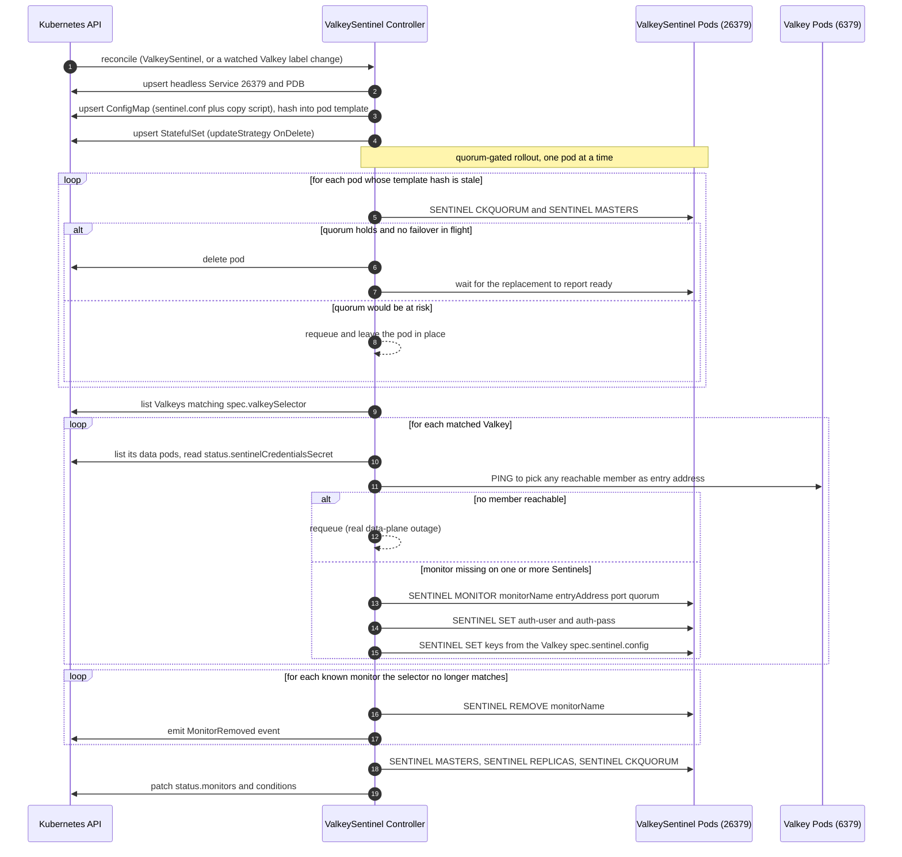
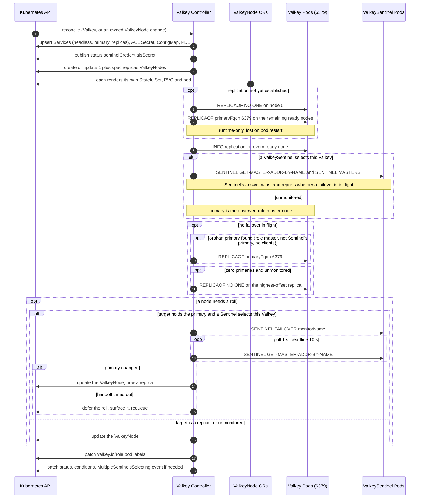

# Valkey and ValkeySentinel Design Proposal

This document proposes support for Valkey **replication mode with Sentinel** in the valkey-operator, alongside the existing cluster mode ([architecture.md](https://github.com/valkey-io/valkey-operator/blob/main/docs/architecture.md)).

It is written to converge with the discussion in [issue #198](https://github.com/valkey-io/valkey-operator/issues/198) and the selector-linked draft in [VALKEY_AND_SENTINEL.md](https://github.com/user-attachments/files/31247232/VALKEY_AND_SENTINEL.md) and adopts their settled decisions: two CRDs (`Valkey` + `ValkeySentinel`), Sentinel tuning as `map[string]string` passthrough rather than typed fields, `spec.replicas` counting replicas in addition to the primary, and Sentinel pods managed as a StatefulSet for the MVP. Where it differs, it says so and why. Design also tries to align with future work on [ValkeyCell CRD](https://github.com/valkey-io/valkey-operator/issues/226).

## Motivation

Today the operator supports cluster mode only ([quickstart.md](https://github.com/valkey-io/valkey-operator/blob/main/docs/quickstart.md)). Replication mode with Sentinel covers a distinct set of users:

- Workloads that need a single keyspace (no hash-slot constraints, multi-key ops and transactions across arbitrary keys, `SELECT`/multiple DBs, Lua scripts touching unrelated keys).
- Existing applications whose clients already speak the Sentinel protocol (`SENTINEL GET-MASTER-ADDR-BY-NAME`), eg. Jedis/Lettuce/go-redis/ioredis sentinel modes, Spring Data Redis, Sidekiq, etc. Migrating these to cluster mode requires client changes, which might be a deal breaker for many organizations. Migrating to a Sentinel-backed deployment is straightforward.
- Small deployments where 3 shards × 2 nodes is more infrastructure than the data warrants.
- Automated failover that does **not** depend on the operator being available.

## Goals

- One primary + N replicas managed as a single logical unit, with automated failover by a Sentinel quorum.
- Failover works while the operator is down. Sentinel(not the operator) is the failover authority.
- Reuse `ValkeyNode` for the data plane **without modifying it**. Sentinel pods are a StatefulSet for the MVP, but share the pod-template builder with `ValkeyNode` rather than duplicating it.
- Reuse existing ValkeyCluster building blocks: ACL/system users, TLS, persistence, scheduling, PDB, exporter, config hashing and rolling restarts.
- Stable client entry points: a write endpoint that follows the primary, a read endpoint over replicas, and a Sentinel endpoint for sentinel-aware clients.
- HA can be enforced. A user can state that an instance requires Sentinel monitoring and get a loud failure when it has none.
- Standalone (`replicas: 0`) falls out of the same CRD as a degenerate case.

## Non-Goals

- Sharding, slot management, or resharding (that is ValkeyCluster; non-cluster sharding is a future `ValkeyCell` that creates N labelled `Valkey`s).
- Migrating an existing ValkeyCluster into replication mode, or vice versa.
- Sentinel in front of a ValkeyCluster (cluster mode has its own failover).
- Cross-namespace Sentinel selection (see [Future work](#future-work)).
- Client-side proxying (no proxy pods are introduced).

### Detailed Design

## Required CRDs

| CRD | Kind of change | Purpose | User-facing |
| --- | --- | --- | --- |
| `Valkey` | **New** | Data plane: one primary + N replicas, and the Services in front of them | Yes |
| `ValkeySentinel` | **New** | Monitoring plane: a Sentinel quorum that selects and monitors one or more `Valkey`s | Yes |
| `ValkeyNode` | **Unchanged** | Data pods reuse it as-is. Two extensions were considered and deferred. See [`ValkeyNode`: no changes](#valkeynode-no-changes) | No (internal) |
| `ValkeyCluster` | Unchanged | — | Yes |

Shared API types (`SchedulingSpec`, `PersistenceSpec`, `ExporterSpec`, `TLSConfig`, `UserAclSpec`, `PodDisruptionBudgetConfig`, `WorkloadType`) are reused as is from `api/v1alpha1`. `PodDisruptionBudgetConfig` is the one imperfect fit as its only enabled mode is literally named `Cluster`. We will work with it for now and refactor and track under [Future work](#future-work).

The two-CRD shape is settled (see [Settled: CRD shape](#settled-crd-shape)). The live question is which side declares the link between them; this document recommends a **selector on the Sentinel side plus an opt-in requirement flag on the data side**. See [Linkage direction](#linkage-direction).

### `Valkey`

```go
// ValkeySpec defines the desired state of Valkey.
type ValkeySpec struct {
    // Replicas is the number of replicas in addition to the primary.
    // Semantics and defaulting match ValkeyCluster.spec.replicas exactly. 
    // Replicas: 0 means a lone primary and N means one primary plus N replicas.
    // +kubebuilder:validation:Minimum=0
    Replicas int32 `json:"replicas,omitempty"`

    // Sentinel carries the data-plane half of Sentinel integration.
    // Whether a Sentinel actually monitors this instance is decided by a ValkeySentinel's spec.valkeySelector matching this object's labels. 
    // This block only configures what monitoring should look like once it happens.
    // +optional
    Sentinel *SentinelConfig `json:"sentinel,omitempty"`

    Image                         string                         `json:"image,omitempty"`
    ImagePullSecrets              []corev1.LocalObjectReference  `json:"imagePullSecrets,omitempty"`
    Resources                     corev1.ResourceRequirements    `json:"resources,omitempty"`
    Scheduling                    *SchedulingSpec                `json:"scheduling,omitempty"`
    Exporter                      ExporterSpec                   `json:"exporter,omitempty"`
    WorkloadType                  WorkloadType                   `json:"workloadType,omitempty"`
    Persistence                   *PersistenceSpec               `json:"persistence,omitempty"`
    Users                         []UserAclSpec                  `json:"users,omitempty"`
    Containers                    []corev1.Container             `json:"containers,omitempty"`
    Config                        map[string]string              `json:"config,omitempty"`
    Networking                    *NetworkingSpec                `json:"networking,omitempty"`
    PodDisruptionBudget           *PodDisruptionBudgetConfig     `json:"podDisruptionBudget,omitempty"`
    PodSecurityContext            *corev1.PodSecurityContext     `json:"podSecurityContext,omitempty"`
    TerminationGracePeriodSeconds *int64                         `json:"terminationGracePeriodSeconds,omitempty"`
}

type SentinelConfig struct {
    // MonitorName is the Immutable Sentinel master-name for this instance.
    // Defaults to metadata.name. 
    // It stays settable so an operator adopting an existing deployment can keep the master-name its clients already use.
    // +optional
    MonitorName string `json:"monitorName,omitempty"`

    // Required makes monitoring a declared requirement rather than an observed property.
    // While no ValkeySentinel selects this instance, the Monitored condition is False and participates in the Ready derivation.
    // Defaults to false, so an unmonitored replicated instance is a valid (manual failover) configuration that does not fail Ready.
    // Also helps run Valkey without Sentinel with some parent, eg. (ValkeyCell).
    // +kubebuilder:default=false
    // +optional
    Required bool `json:"required,omitempty"`

    // Quorum is the number of Sentinels that must agree this instance's primary is down.
    // Passed to SENTINEL MONITOR. Defaults to (selecting sentinel's replicas / 2) + 1.
    // When several ValkeySentinels of different sizes select this instance the default differs per registration.
    // Set it explicitly to pin it.
    // +kubebuilder:validation:Minimum=1
    // +optional
    Quorum *int32 `json:"quorum,omitempty"`

    // Config is per-master Sentinel tuning.
    // Forwarded as SENTINEL SET <monitorName> <key> <value>.
    // The operator does not validate them. 
    // Operator-owned keys are ignored with a ConfigurationWarning rather than silently applied.
    // +optional
    Config map[string]string `json:"config,omitempty"`
}

// ValkeyStatus defines the observed state of Valkey.
type ValkeyStatus struct {
    // State is a high-level summary
    // Initializing, Reconciling, Ready, Degraded, Failed
    State   ValkeyState `json:"state,omitempty"`
    Reason  string      `json:"reason,omitempty"`
    Message string      `json:"message,omitempty"`

    // Primary is the ValkeyNode currently serving as primary.
    Primary string `json:"primary,omitempty"`

    // PrimaryAddress is the address clients should write to.
    PrimaryAddress string `json:"primaryAddress,omitempty"`

    Replicas       int32 `json:"replicas,omitempty"`
    ReadyReplicas  int32 `json:"readyReplicas,omitempty"`
    SyncedReplicas int32 `json:"syncedReplicas,omitempty"`

    // Monitoring reports which ValkeySentinels monitor this instance.
    Monitoring *MonitoringStatus `json:"monitoring,omitempty"`

    // SentinelCredentialsSecret names the Secret and key holding the _sentinel system user's password.
    // It is the only credential a selecting ValkeySentinel controller is expected to read for this instance.
    SentinelCredentialsSecret *corev1.SecretKeySelector `json:"sentinelCredentialsSecret,omitempty"`

    ObservedGeneration int64              `json:"observedGeneration,omitempty"`
    Conditions         []metav1.Condition `json:"conditions,omitempty"`
}

type MonitoringStatus struct {
    // MonitoredBy lists the ValkeySentinels currently selecting this instance.
    // More than one is allowed but warned about.
    MonitoredBy []string `json:"monitoredBy,omitempty"`
    MonitorName string   `json:"monitorName,omitempty"`
    // Registered is true when every ready Sentinel pod of every selecting
    // ValkeySentinel reports this monitor.
    Registered      bool  `json:"registered,omitempty"`
    Quorum          int32 `json:"quorum,omitempty"`
    AvailableQuorum int32 `json:"availableQuorum,omitempty"`
}
```

Conditions (following [status-conditions.md](https://github.com/valkey-io/valkey-operator/blob/main/docs/status-conditions.md)): `Ready`, `Progressing`, `Degraded`, `ConfigurationWarning`, plus:

- `PrimaryElected`: Exactly one node reports `role:master`.
- `ReplicationHealthy`: Every replica reports `master_link_status:up`.
- `Monitored`: At least one `ValkeySentinel` selects this instance and has registered the monitor. It participates in `Ready` when `spec.sentinel.required` is true.
- `SentinelQuorumHealthy`: `SENTINEL CKQUORUM <monitorName>` succeeds, meaning there are enough Sentinels to both detect failure and authorize failover.

Validation:

- `spec.sentinel.monitorName` is immutable. Renaming a monitor means `SENTINEL REMOVE` plus re-registration. That is a deliberate teardown, not an edit.
- `spec.sentinel.required` requires `spec.replicas >= 1`. There is nothing to fail over to otherwise.
- `spec.persistence` immutability and expand-only rules, plus the `persistence` with `workloadType == Deployment` exclusion, copied from `ValkeyClusterSpec`.
- `workloadType == Deployment` is additionally rejected when `spec.replicas > 0`. Replication needs the stable per-pod DNS that only a StatefulSet provides (see [Why per-pod DNS](#Why-per-pod-DNS)).
- `spec.sentinel.quorum` cannot be CEL-validated against the selecting Sentinel's replica count, because that lives on a different object. It is checked at registration time instead. The operator raises a `ConfigurationWarning` when the value exceeds the available Sentinel count, or when it falls at or below half of it.

### `ValkeySentinel`

```go
// ValkeySentinelSpec defines a Sentinel quorum and what it monitors.
type ValkeySentinelSpec struct {
    // Replicas is the number of Sentinel pods. Minimum is 3.
    // Keep replicas as odd number.
    // +kubebuilder:validation:Minimum=3
    // +kubebuilder:default=3
    Replicas int32 `json:"replicas,omitempty"`

    // ValkeySelector selects the Valkeys in this namespace to monitor.
    // An empty selector matches nothing rather than everything.
    // Matching everything by default would silently enroll instances a user never intended.
    // +optional
    ValkeySelector *metav1.LabelSelector `json:"valkeySelector,omitempty"`

    // Config is process-global sentinel.conf tuning, written to the config file as is.
    // Per-master options belong on the Valkey CR (spec.sentinel.config) and are applied via SENTINEL SET.
    // Operator-owned directives win over user keys.
    // A collision raises a ConfigurationWarning.
    // +optional
    Config map[string]string `json:"config,omitempty"`

    Image              string                        `json:"image,omitempty"`
    ImagePullSecrets   []corev1.LocalObjectReference `json:"imagePullSecrets,omitempty"`
    Resources          corev1.ResourceRequirements   `json:"resources,omitempty"`
    Scheduling         *SchedulingSpec               `json:"scheduling,omitempty"`
    Containers         []corev1.Container            `json:"containers,omitempty"`
    Networking         *NetworkingSpec               `json:"networking,omitempty"`
    PodSecurityContext *corev1.PodSecurityContext    `json:"podSecurityContext,omitempty"`

    // Persistence for Sentinel's rewritten config. It is optional.
    // Sentinel state is reconstructable from re-registration plus gossip.
    // +optional
    Persistence *PersistenceSpec `json:"persistence,omitempty"`

    // PodDisruptionBudget reuses the ValkeyCluster type as is.
    // TODO: Ensure PodDisruptionBudget is not strictly tied to Cluster mode.
    // +optional
    PodDisruptionBudget *PodDisruptionBudgetConfig `json:"podDisruptionBudget,omitempty"`
}

type ValkeySentinelStatus struct {
    State         SentinelState `json:"state,omitempty"`
    Reason        string        `json:"reason,omitempty"`
    Message       string        `json:"message,omitempty"`
    Replicas      int32         `json:"replicas,omitempty"`
    ReadyReplicas int32         `json:"readyReplicas,omitempty"`

    // Monitors is the live view from SENTINEL MASTERS across ready pods.
    // It is intersected with the current selector match.
    Monitors []MonitorStatus `json:"monitors,omitempty"`

    ObservedGeneration int64              `json:"observedGeneration,omitempty"`
    Conditions         []metav1.Condition `json:"conditions,omitempty"`
}

type MonitorStatus struct {
    // Name is the monitor (master) name, and Valkey is the CR it came from.
    Name   string `json:"name"`
    Valkey string `json:"valkey,omitempty"`

    PrimaryAddress string `json:"primaryAddress,omitempty"`
    Quorum         int32  `json:"quorum,omitempty"`
    
    // OK is the result of SENTINEL CKQUORUM.
    OK bool `json:"ok,omitempty"`
    // Replicas is the replica count Sentinel itself discovered.
    // It can lag or differ from Valkey.status.readyReplicas.
    Replicas int32 `json:"replicas,omitempty"`
}
```

### `ValkeyNode`: no changes

Data pods use `ValkeyNode` exactly as it exists today. Two extensions were considered and both are deferred.

**A per-node config hint (`spec.replicaOf`), deferred.** Replication mode would like each pod's `valkey.conf` to differ. Node 0 carries no `replicaof` and nodes 1..N point at the primary. The current wiring cannot express that. The parent renders one ConfigMap for the whole set (`config.go:196`) and stamps that same name onto every node (`valkeycluster_controller.go:939`). The node controller then skips creating its own (`valkeynode_controller.go:650-653`) and mounts the shared one. It is launched by a fixed command with no shell to substitute into (`valkeynode_resources.go:170-172`, `420-422`). Every pod in a set therefore mounts identical config.

The accepted consequence is that replication is established by command and is runtime-only state. `CONFIG REWRITE` cannot persist it either, since the config is a read-only ConfigMap mount. A pod that restarts, whether from a node drain, an upgrade, an eviction or an OOM kill, comes back as its own primary. Because it is not replicating, it never appears in the real primary's `INFO replication`, which is exactly where Sentinel discovers replicas. Sentinel cannot see it, so Sentinel cannot fix it. The [repair rule](#valkey-controller) is the mitigation for now. The residual exposure is recorded under [Risks](#risks) and the durable fix under [Future work](#future-work).

**Sentinel as a `ValkeyNode`, deferred.**

`ValkeyNode` is defined around a Valkey server pod. Its `status.role` is primary or replica, it reports replication state, and it owns a PVC. The singleton-per-pod shape exists so each data pod can be scheduled independently. Sentinel pods are interchangeable, need no PVC, and want no per-pod scheduling divergence. Three identical pods is what a StatefulSet does best. Adopting `ValkeyNode` would buy pod-template reuse and naturally quorum-gated rolls. Both are obtainable more cheaply, by sharing the template builder and using `updateStrategy: OnDelete`. Revisit when `ValkeyNode` grows alternate-binary, alternate-port, and no-PVC support.

## Configuration surface

Sentinel's knobs split across three apply paths. A single flat map hides that distinction. Where each key belongs:

| Category | Examples | Apply path | Where it lives |
| --- | --- | --- | --- |
| Structural | `monitor`, quorum | `SENTINEL MONITOR` | Operator only. `Valkey.spec.sentinel.quorum` supplies the quorum argument |
| Per-master runtime | `down-after-milliseconds`, `failover-timeout`, `parallel-syncs`, `notification-script` | `SENTINEL SET <master>` | `Valkey.spec.sentinel.config` |
| Credentials | `auth-user`, `auth-pass`, `sentinel-user`, `sentinel-pass` | `SENTINEL SET` / `sentinel.conf` | Operator only, from the ACL Secret |
| Process-global | `resolve-hostnames`, `announce-hostnames`, `announce-ip`, `announce-port` | `sentinel.conf` | `ValkeySentinel.spec.config`, with operator-owned keys reserved |

Two maps rather than one, because per-master and process-global directives have genuinely different scopes and apply paths. A design with only a `SENTINEL SET` oriented map leaves no way to set a process-global directive at all.

Typed fields were considered and rejected. Sentinel's directive set is very stable. The core has been unchanged since Redis 2.8, with roughly one or two additions per major release and no removals (`deny-scripts-reconfig` in 5.0, `sentinel-user` and `sentinel-pass` in 5.0.1, `auth-user` in 6.0, `resolve-hostnames` and `announce-hostnames` in 6.2, `master-reboot-down-after-period` in 7.0). So churn is not the argument. The real arguments are that `ValkeyCluster.spec.config` already set this precedent, that the operator has no business validating Valkey's ranges, and that a map which later grows a few typed fields is additive. Typed fields that turn out wrong are a v1alpha1 to v1beta1 break.

Operator-owned key handling follows the existing `getBaseConfig` precedent for file-rendered config, where base directives are written last and win. A collision raises a `ConfigurationWarning` so the override is visible rather than silent. For `SENTINEL SET` config there is no file ordering, so reserved keys are skipped and warned about instead.

## Topology

```
Valkey "auth-cache"            labels: {tier: caching}
├── ValkeyNode auth-cache-0        (primary)
├── ValkeyNode auth-cache-1        (replica)
├── ValkeyNode auth-cache-2        (replica)
├── Service valkey-auth-cache            (headless, all members)
├── Service valkey-auth-cache-primary    (selector: role=primary)
├── Service valkey-auth-cache-replicas   (selector: role=replica)
├── Service valkey-auth-cache-0/-1/-2    (per-node governing Services, for stable pod DNS)
├── ConfigMap valkey-auth-cache          (valkey.conf + probe scripts)
├── Secret internal-auth-cache-acl                (ACL file, incl. _sentinel)
├── Secret internal-auth-cache-system-passwords   (system user passwords)
└── PodDisruptionBudget valkey-auth-cache

Valkey "session-store"         labels: {tier: caching}
Valkey "rate-limits"           labels: {tier: caching}

ValkeySentinel "monitors"
  spec.replicas: 3
  spec.valkeySelector.matchLabels: {tier: caching}
├── StatefulSet valkey-sentinel-monitors   (3 pods, updateStrategy: OnDelete)
├── Service valkey-sentinel-monitors       (headless, 26379, publishNotReadyAddresses)
├── ConfigMap valkey-sentinel-monitors     (sentinel.conf template + copy script)
└── PodDisruptionBudget valkey-sentinel-monitors  (maxUnavailable: 1)

This monitors all three Valkeys from one 3-pod quorum.
```

Data node names follow the existing convention with the shard dimension dropped, so `<name>-<index>`, with index 0 being the *initial* primary. As in cluster mode, that index is a bootstrap fact rather than live truth. The live role is always read from `INFO replication` or from Sentinel.

`SENTINEL MONITOR` uses `spec.sentinel.monitorName`, which defaults to the `Valkey`'s `metadata.name`. Namespace-scoped name uniqueness makes collisions structurally impossible in the default case.

### Client entry points

Three, so both sentinel-aware and sentinel-unaware clients work:

1. **`valkey-<name>-primary`**: A ClusterIP Service whose selector includes `valkey.io/role: primary`. The operator maintains a `valkey.io/role` label on each pod from the observed role, so the endpoint follows failover without clients knowing about Sentinel. Convergence is bounded by reconcile latency after a failover (see [Watching failover](#watching-failover)). This endpoint is therefore eventually correct, not instantly correct.
2. **`valkey-<name>-replicas`**: A ClusterIP Service selecting `valkey.io/role: replica`, for read scaling.
3. **`valkey-sentinel-<name>`**: A headless Service over the Sentinel pods on 26379. Sentinel-aware clients use this and get instant, operator-independent failover awareness. **This is the recommended path** and must be documented as such. The role-labelled Services are a convenience with a documented lag.

## Why per-pod DNS?

Sentinel discovers replicas by parsing `INFO replication` on the primary and by gossiping over `__sentinel__:hello`. It persists the resolved addresses in its own rewritten config. On Kubernetes, pod IPs change on every restart, so an IP-based setup leaves Sentinel holding dead addresses.

Resolution: use stable DNS names everywhere and let Sentinel resolve them.

- Servers get `replica-announce-ip <pod-fqdn>` and `replica-announce-port 6379`.
- Sentinels get `sentinel announce-ip <pod-fqdn>` / `announce-port`.
- Sentinel config sets `sentinel resolve-hostnames yes` and `sentinel announce-hostnames yes`, and monitors are registered by hostname rather than IP.

**Per-pod DNS does not exist in this repository today, and this design has to add it.** Each `ValkeyNode`'s StatefulSet sets `spec.serviceName` to its own resource name. Nothing ever creates a Service by that name. The only Service is the parent's set-wide headless one, and the operator reaches pods by `status.podIP`, using the headless FQDN solely as a TLS `serverName`. The `Valkey` controller therefore has to create one headless governing Service per node, matching the name the StatefulSet already points at. The resulting FQDN is `valkey-<name>-<i>-0.valkey-<name>-<i>.<ns>.svc.cluster.local`. Note that the subdomain is the per-node Service, not the set-wide one.

Stable identity also requires `workloadType: StatefulSet`. **`Deployment` is rejected whenever `spec.replicas > 0`.** A selecting `ValkeySentinel` also refuses to monitor a Deployment-backed instance. It emits a warning rather than registering a monitor it cannot address durably. The gate is on `replicas` rather than on `spec.sentinel`, because under the selector model an instance can be monitored without ever setting `spec.sentinel`. A standalone `replicas: 0` cache on a Deployment stays legal, since there is no replication to preserve and nothing to fail over. Cluster mode tolerates Deployments because `CLUSTER MEET` and nodes.conf re-converge on IP changes through the operator. Sentinel has no equivalent operator-mediated repair path.

Hostname resolution support must be pinned in docs. It comes from the Redis 6.2 lineage and is present in Valkey. The reconciler surfaces a `ConfigurationWarning` if the image reports an older version.

## Sentinel pod specifics

- **Writable config.** Sentinel rewrites its own config, calling `CONFIG REWRITE` on every monitor or failover change, and a ConfigMap mount is read-only. So the pod copies `sentinel.conf` from the ConfigMap into `/data/sentinel.conf` at startup, using an init container or an entrypoint copy, then runs `valkey-sentinel /data/sentinel.conf`. `/data` is an emptyDir by default, or a PVC when `spec.persistence` is set. This keeps `readOnlyRootFilesystem: true` intact, a posture already asserted by `test/e2e/valkeycluster_readonly_rootfs_test.go`.
- **Losing `/data` is safe** but not free. A restarted Sentinel with an empty config re-learns monitors from re-registration and the rest from gossip. It does not count toward quorum during that window. Default to emptyDir and document the PVC option.
- **Credential contract.** Sentinel needs credentials for every monitored server, via `SENTINEL SET <name> auth-user` and `auth-pass`. When the Sentinels themselves require auth, it also needs `sentinel-user` and `sentinel-pass` for inter-Sentinel traffic. This adds a `_sentinel` system user in `internal/controller/users.go` alongside `_operator`, `_exporter`, and `_replication`. Its ACL rawstring comes from the [Valkey ACL docs for Sentinel and replicas](https://valkey.io/topics/acl/#acl-rules-for-sentinel-and-replicas), the same source already cited for the replication user. The exact rawstring must be validated against the target Valkey version before merge. It needs at minimum `+multi +exec +ping +info +role +publish +subscribe +replicaof +config|rewrite +client|setname +client|kill +script|kill` and `allchannels`. The `Valkey` controller creates the user and publishes its location in `status.sentinelCredentialsSecret`. In practice that is `internal-<name>-system-passwords`, key `_sentinel`, following `getSystemPasswordSecretName`. The ACL file itself lives in `internal-<name>-acl` and user-supplied passwords in `<name>-users`. A selecting `ValkeySentinel` controller reads only the Secret and key named in status. Without this contract, a selector-linked design implicitly grants the Sentinel controller read access to every matched instance's ACL Secret, with no defined boundary.
- **TLS.** Sentinel gets `tls-port 26379`, `port 0`, and the same cert Secret as the servers it monitors. Monitors are registered against the servers' TLS port. Mixed TLS and non-TLS across one Sentinel's selected set is rejected, because a single Sentinel process cannot speak both.
- **Not `CONFIG SET`-managed.** The `liveConfigAllowlist` path is for data nodes. Sentinel's live changes go through `SENTINEL SET`.

## Reconcile flow

### ValkeySentinel controller

Owns the monitoring plane and every monitor-lifecycle command.

1. Upsert the headless Service on 26379, with `publishNotReadyAddresses: true` so Sentinels can gossip before readiness. Upsert the PDB with `maxUnavailable: 1`. That is enough for the default 3-pod quorum. See [Future work](#future-work) for quorum-aware budgets.
2. Upsert the ConfigMap holding the `sentinel.conf` base directives, `spec.config`, and the copy script. Hash it into the pod template annotation, reusing the existing config-hash mechanism.
3. Upsert the StatefulSet with `updateStrategy: OnDelete`, so pod replacement order is the operator's decision rather than the StatefulSet controller's.
4. Roll pods one at a time. Delete the next only while `SENTINEL CKQUORUM` passes for every monitor and no failover is in progress, meaning `SENTINEL MASTERS` reports a `failover_state` of none throughout. This is stricter than the data-plane rule. Rolling two Sentinels concurrently in a 3-pod quorum makes failover impossible for the duration.
5. List `Valkey`s in the namespace matching `spec.valkeySelector`. For each match:
    - Choose an entry address. Use any reachable pod of that `Valkey`, not `Valkey.status.primary`. Sentinel follows `INFO replication` from any member to find the real primary. That avoids a cross-CR status dependency, and the bootstrap race where status is not yet populated. This mechanic is adopted from the selector draft, where it is a better fit than pushing the observed primary. If no pod is reachable, requeue.
    - Issue `SENTINEL MONITOR <monitorName> <entry-address> <port> <quorum>` on any ready pod missing the monitor. Then issue `SENTINEL SET` for the credentials, plus every key in the `Valkey`'s `spec.sentinel.config`. This stays idempotent by diffing against the live `SENTINEL MASTERS` view first.
6. Find every monitor a Sentinel knows about that the selector no longer matches, whether from a de-labelled or a deleted `Valkey`, and issue `SENTINEL REMOVE <name>`. A relabel is an intentional opt-out, so there is no grace period. It is still recorded as an event, because it silently removes HA.
7. Write `status.monitors` from `SENTINEL MASTERS`, `SENTINEL REPLICAS` and `SENTINEL CKQUORUM` across ready pods.

Watches `Valkey` objects so a label change reconciles monitoring within one event hop.

The same flow as a sequence:



### Valkey controller

Owns the data plane. It issues no monitor-lifecycle commands. Its only Sentinel interaction is the planned-failover trigger, because it is the controller that rolls pods.

1. Upsert the Services, the ACL Secret including `_sentinel`, the server ConfigMap, and the PDB. The headless Service, ConfigMap, ACL Secret and PDB reuse the ValkeyCluster helpers. The two role-selector Services are new. Publish `status.sentinelCredentialsSecret`.
2. Create or update `1 + spec.replicas` ValkeyNodes, all sharing one ConfigMap. Establish replication by command as pods become ready. That means `REPLICAOF NO ONE` on node 0 at first bootstrap, and `REPLICAOF <primary-fqdn> 6379` on the rest. None of this survives a pod restart. See [`ValkeyNode`: no changes](#valkeynode-no-changes).
3. Read live state. Run `INFO replication` on every ready node. When `status.monitoring.monitoredBy` is non-empty, also run `SENTINEL GET-MASTER-ADDR-BY-NAME` against a selecting Sentinel. The primary is **Sentinel's answer** when monitored, and the observed `role:master` node otherwise.
4. Repair only what Sentinel cannot, and only while no failover is in progress:
    - A node reporting `role:master` that is not Sentinel's primary and has no clients gets `REPLICAOF <primary>`. This covers the split-brain rejoin. More commonly it covers a restarted pod that came back as an orphan primary, because replication was never persisted (see [`ValkeyNode`: no changes](#valkeynode-no-changes)). Sentinel cannot see such a pod, because a node that is not replicating never appears in the primary's `INFO`. Until per-node config lands, **this rule is the only thing that repairs it**, so unlike both prior drafts it cannot be dropped. Refusing to re-issue `REPLICAOF` after bootstrap leaves the set permanently short a replica.
    - Zero primaries and no selecting Sentinel means promote the best-synced ready node, using `HighestOffsetReplica`. With a selecting Sentinel, do nothing. The election is Sentinel's.
    - Never target Sentinel's chosen primary. Fighting Sentinel is this design's principal failure mode. Every topology write is gated on `SENTINEL MASTERS` reporting no in-flight failover.
5. Maintain the `valkey.io/role` pod labels that drive the primary and replica Services.
6. Compute `Monitored` from the set of `ValkeySentinel`s selecting this object. Emit a `MultipleSentinelsSelecting` warning when more than one does, since their per-master `SENTINEL SET` values race and the last applied wins.
7. Update status and conditions.

The same flow as a sequence, including the planned-roll branch described in [Planned operations](#planned-operations):



### Planned operations

- **Rolling a replica.** One at a time, gated on `master_link_status:up` for the remaining replicas.
- **Rolling the primary.** Hand off first, mirroring `internal/controller/failover.go` but with `SENTINEL FAILOVER <monitorName>` instead of `CLUSTER FAILOVER`. Sentinel must perform the promotion so that its view and the operator's stay consistent. Poll `SENTINEL GET-MASTER-ADDR-BY-NAME` on a 1 second tick with a 10 second deadline until it changes, then roll the old primary, which is now a replica. Unlike the prior drafts, the timeout is **not** soft. If the handoff does not complete, the roll is deferred and surfaced. Rolling the primary anyway would drop writes for up to `down-after-milliseconds` and risk the orphan case above.
- **Rolling the primary of an unmonitored instance.** Promote the best-synced replica with `REPLICAOF NO ONE`, repoint the others, then roll. If `spec.replicas == 0` there is nothing to do but accept the restart.
- **Scale out.** Create the node, then issue `REPLICAOF <primary>` once its pod is ready. Sentinel discovers it from the primary's `INFO`.
- **Scale in.** Delete the highest-index ValkeyNode, then issue `SENTINEL RESET <monitorName>` once, so Sentinel forgets the removed replica instead of reporting it `sdown` forever. `RESET` re-discovers everything, so it is issued once per scale-in and never in steady state.
- **Deletion.** No cross-CR finalizer. Deleting a `Valkey` cascades its own children, and the selecting `ValkeySentinel` observes the disappearance and issues `SENTINEL REMOVE`. Deleting a `ValkeySentinel` cascades its StatefulSet and leaves monitored instances running in whatever topology Sentinel last set, with `Monitored=False` on the next reconcile.
- **`shutdown-on-sigterm`.** Cluster mode sets `failover`, which is cluster-specific. Here the primary's graceful shutdown is preceded by the handoff above, so `terminationGracePeriodSeconds` derives from `failover-timeout` rather than from `cluster-manual-failover-timeout`.

### Watching failover

There are three ways to learn that a failover happened, ordered by latency. Subscribing to `+switch-master` on Sentinel's pub/sub channel is sub-second, but needs a long-lived connection per Sentinel. Polling `SENTINEL GET-MASTER-ADDR-BY-NAME` on a short requeue is slower. Noticing the role change in `INFO replication` is slower still.

Poll first. It is simpler, consistent with the current reconciler style, and only the convenience Services care about the lag. A pub/sub watcher is a later optimization.

### Linkage direction

Both CRDs are agreed. What remains is which side declares the link.

| Option | Pros | Cons |
| --- | --- | --- |
| **Ref**, via `Valkey.spec.sentinel.sentinelRef` (initial issue #198) | HA is declarative. An unresolvable ref fails loudly with `Ready=False/SentinelRefUnresolved` | Apply order becomes semantic. It also needs a cross-CR finalizer and `DependentsPresent` to stop a shared Sentinel being deleted out from under its dependents |
| | Exactly one Sentinel per instance, so there is no ambiguity about whose `SENTINEL SET` wins | Onboarding N instances means N spec edits. Deleting a Sentinel set becomes an error path that requires unwinding dependents first |
| | Per-master config has an obvious home, and credentials flow from the controller that owns the Secret | Three extra conditions exist purely to describe reference health |
| **Selector**, via `ValkeySentinel.spec.valkeySelector` (later approached in #198) | No apply order, no cross-CR finalizer, and no reference-health conditions | HA stops being declarable. A typo'd or dropped label silently means no failover, visible only as an advisory condition |
| | Onboarding is a label. One quorum covers 3 or 300 instances with no Sentinel-side edit | Two Sentinels can select the same instance. It is allowed, but their per-master `SENTINEL SET` values race and the last applied wins |
| | Deleting a Sentinel set is a routine `kubectl delete` | Per-master tuning has no natural home, which pushed that draft to global-only config |
| | Familiar Prometheus-operator `ServiceMonitor` precedent | The Sentinel controller must read matched instances' credentials, which inverts the RBAC direction |
| **Hybrid** (recommended). Selector for linkage, plus `spec.sentinel.required`, per-master `spec.sentinel.config`, and a published credential Secret reference | Keeps every selector advantage. Makes HA declarable again for users who want it. Per-master tuning survives, and credential access has a defined boundary | One more field than either pure option. `required` is also a second place to look when diagnosing why an instance is not Ready |

**Recommendation: hybrid.** The selector genuinely solves the problem #198 surfaced, where 30 instances each with a dedicated 3-pod quorum means 90 pods of monitoring. It also deletes the finalizer, the apply-order semantics, and three conditions. Its two real costs are that HA becomes unassertable and per-master tuning disappears. Both are recoverable for the price of one bool and one map. The credential direction is the part no draft has addressed, and `status.sentinelCredentialsSecret` bounds it.

### Settled: CRD shape

Recorded for completeness. The discussion in #198 settled this.

| Option | Verdict |
| --- | --- |
| Two CRDs (`Valkey` + `ValkeySentinel`) | **Chosen.** Sentinel's lifecycle is independent of any monitored instance and one quorum serves many, which a single CRD cannot express. |
| One CRD with inline Sentinel pods | Rejected. It gives the simplest API and trivially correct deletion, but forces a quorum per instance, which is exactly the pod-count problem. It also buries Sentinel health in the parent's status. |
| Extend `ValkeyCluster` with `spec.mode` | Rejected. Maximum plumbing reuse, but `shards` becomes meaningless, a 1500-line reconciler grows a second state machine, and the kind's name stops being true. |
| No Sentinel, operator-driven failover only | Rejected as the *primary* design, because failover would require the operator to be running, which is what Sentinel exists to avoid. Retained as the behaviour of an unmonitored instance, so replication without three extra pods stays available. |

### Sentinel placement

| Option | Pros | Cons |
| --- | --- | --- |
| **Dedicated pods** (recommended) | Survives a data-pod roll. Scheduled independently of the data. Quorum size is decoupled from replica count. A Sentinel OOM cannot take out a data node | 3 extra pods per quorum, amortized across all selected instances. Another workload to roll |
| **Sidecar in each data pod** | Zero extra pods. Sentinel count tracks replica count. Shares the pod's DNS name | Rolling a server rolls a voter, so an update walks the quorum and the data plane at once. `replicas: 1` yields a 2-Sentinel quorum that tolerates no loss. A node failure removes both a data node and a voter |
| **One shared fleet, no per-tenant option** | Cheapest at scale | No isolation. One bad monitor's `SENTINEL RESET` affects every selected instance |

The selector model gets both ends of the last row: a platform-wide quorum and a per-tenant one are the same object with different selectors.

### Monitor registration ownership

| Option | Pros | Cons |
| --- | --- | --- |
| **Sentinel-side** (recommended, follows from the selector) | The controller that knows the selector owns the monitor lifecycle. All `SENTINEL MONITOR`, `SET` and `REMOVE` calls live in one place. The entry-address mechanic removes any dependency on `Valkey.status` | Must read each matched instance's `_sentinel` credential, bounded by `status.sentinelCredentialsSecret` |
| **Data-side push** | The controller that owns the credential Secret is the one that registers | Cannot see the selector, so it would have to reverse-engineer which Sentinels match it. It also splits monitor lifecycle across two controllers |

Keep the asymmetry this creates explicit. Monitor *lifecycle* is Sentinel-side. The planned-failover *trigger* stays data-side, because that is the controller deciding to roll a pod.

## Implementation notes

Constraints in the current repository that this design depends on, and what has to change.

**RBAC additions.** `config/rbac/role.yaml` today grants pods `get`/`list`/`watch` only, and this design needs two more verbs on pods:

| Verb | Needed for |
| --- | --- |
| `patch` | Maintaining the `valkey.io/role` label that drives the primary and replica Services. Without it, those Services cannot work at all |
| `delete` | Driving the Sentinel StatefulSet's `OnDelete` rollout one pod at a time under the `CKQUORUM` gate |

StatefulSets, ConfigMaps, Secrets, Services and PodDisruptionBudgets already carry full verbs, so no other changes are needed. `role.yaml` is generated from kubebuilder markers, so the grants belong on the new controllers and are picked up by `make manifests`. It is never hand-edited (see [architecture.md](architecture.md)).

**No `valkey.io/role` label exists yet.**: `utils.go` defines only `valkey.io/cluster`, `valkey.io/shard-index` and `valkey.io/node-index`. The role label is new. It has to be a pod label rather than a workload-template label, because the role changes over the pod's life. That is why `patch` on pods is required, rather than an update to the StatefulSet template.

**The client library covers Sentinel only partially.**: `valkey-go v1.0.68` provides typed builders for `SentinelFailover`, `SentinelGetMasterAddrByName`, `SentinelReplicas` and `SentinelSentinels` only. `SENTINEL MONITOR`, `SET`, `REMOVE`, `RESET`, `MASTERS` and `CKQUORUM` are most of what the registration path needs, and all of them must go through `B().Arbitrary(...)` (`internal/cmds/builder.go`) with hand-written reply parsing. Budget for a real `internal/valkey` Sentinel layer rather than assuming the existing client covers it.

**The config renderer is already reusable, but the pod-template builder is not.**: `getBaseConfig` and `renderServerConfig` take plain values rather than a `*ValkeyCluster` (`config.go`), so both the `Valkey` and Sentinel config paths can call them directly. `buildValkeyNodePodTemplateSpec` and `buildContainersDef` (`valkeynode_resources.go`) still take a `*ValkeyNode`. So the goal of sharing the builder means extracting the parts a Sentinel pod needs, namely volumes, security context, TLS and probe wiring, rather than calling them as they stand.

**Per-node governing Services are new work.**: The StatefulSets already name a governing Service that nothing creates, so the `Valkey` controller must create it for per-pod DNS to resolve at all.

## Risks

- **Operator versus Sentinel conflict**: Sentinel is the single source of truth for the primary whenever a monitor exists. Every operator topology write is gated on there being no in-flight failover, and never targets Sentinel's primary. Planned promotion goes through `SENTINEL FAILOVER`.
- **Orphaned pods after restart**: Mitigated only by the `REPLICAOF` repair rule, which means repair depends on the operator running. That is the one dependency Sentinel exists to remove. While the operator is down, a restarted replica sits as an orphan primary, and if it is labelled `role=primary` it joins the write Service alongside the real primary. This is bounded by reconcile latency in normal operation, and closed properly by per-node config ([Future work](#future-work)). Both prior drafts leave this failure open entirely.
- **Silent loss of HA** from a label typo or an edited selector. Mitigated by `spec.sentinel.required`, the `Monitored` condition, and an event on `SENTINEL REMOVE`.
- **Racing Sentinels** when two select the same instance, where the last applied `SENTINEL SET` wins. Mitigated by `MultipleSentinelsSelecting` and by `status.monitoring.monitoredBy` making the overlap visible.
- **Stale addresses**, if the per-node governing Services are missing, hostname resolution is unavailable, or an instance runs on a Deployment. Mitigated by creating those Services, rejecting `Deployment` above `replicas: 0`, refusing to monitor Deployment-backed instances, and warning on images without `resolve-hostnames`.
- **Quorum loss during rolls.** Mitigated by `OnDelete`, one-at-a-time replacement, and `CKQUORUM` gating. The reused PDB contributes `maxUnavailable: 1`, which is sufficient at the default 3 replicas but does not protect a quorum above `replicas-1`. The gate, not the budget, is what makes this safe until a `Quorum` PDB mode exists.
- **Divergent replica views.** A replica that is up but unreachable *from the primary* is invisible to Sentinel while visible to the operator. Status reports both views, as `status.readyReplicas` and `MonitorStatus.replicas`, rather than reconciling them into one number.

## Delivery phases

1. **`Valkey` without Sentinel.**: A primary plus replicas over unmodified `ValkeyNode`s. The set-wide, role-labelled and per-node governing Services, plus the pod `patch` RBAC the role labels need. Command-driven replication with the repair rule. Reuse of ACL, TLS, persistence and PDB. Operator-driven promotion. This ships standalone and plain replication, and is independently useful.
2. **`ValkeySentinel` pods.**: A StatefulSet with `OnDelete`, the ConfigMap and copy script, the headless Service, the PDB, and `status` from `SENTINEL MASTERS`. No selection yet.
3. **Selection and registration.**: `valkeySelector`, monitor register, update and remove, the credential contract, and the `Monitored` and `SentinelQuorumHealthy` conditions.
4. **Sentinel-authoritative operations.**: Primary read from Sentinel, `SENTINEL FAILOVER` before planned primary rolls, `SENTINEL RESET` on scale-in, and gating the phase-1 repair rule on Sentinel's view so the two never fight.
5. **Polish.**: The `+switch-master` pub/sub watcher, Sentinel metrics (`valkey_operator_sentinel_*`), docs for `required` enforcement, and migrating Sentinel pods onto `ValkeyNode` if and when it grows the needed primitives.

## Testing

- **Unit**: (`internal/valkey/`). Parsers for `SENTINEL MASTERS`, `REPLICAS` and `SENTINELS`, quorum math, monitor diffing, and reserved-key filtering. These are pure functions, so table-driven tests mirroring `clusterstate_test.go` fit.
- **envtest**: (`internal/controller/`). CRD validation, covering immutable `monitorName`, `required` needing replicas, and `Deployment` rejected above `replicas: 0`. Selector matching and de-selection. Child-object shape, including the per-node governing Services. One-at-a-time roll ordering. Condition transitions against a faked Sentinel client.
- **e2e** (Kind): Bootstrap 1 primary and 2 replicas with a 3-pod quorum. Kill the primary pod and assert a new primary **with the operator scaled to zero**. That is the test that proves the point of the feature. Separately, with the operator **running**, delete a replica pod and assert the repair rule rebuilds replication. That is the orphan case, and by construction it cannot pass with the operator down until per-node config lands. Resolve a pod FQDN from inside the cluster to prove the governing Services work. Relabel an instance and assert `SENTINEL REMOVE`. Scale in and assert no lingering `sdown` entries. Roll the Sentinel image and assert quorum never drops below `quorum`. Run one Sentinel monitoring three instances. Cover TLS and read-only-rootfs variants.

## Future work

- **Per-node config, so replication survives a restart without the operator**: This is the durable fix for the orphan case in [`ValkeyNode`: no changes](#valkeynode-no-changes). There are two viable shapes. The first is to leave `ServerConfigMapName` empty and extend `generateValkeyNodeConfig` (`config.go`) so each `ValkeyNode` renders its own file including `replicaof`. Note that this path currently ignores `Spec.Config` for the file. The second is to keep the shared ConfigMap and add a tiny per-node one holding just `replicaof`, pulled in by an `include` at the end of the shared `valkey.conf`. There the include target must always exist, empty for node 0, or startup fails. The second option is the smaller diff, and it preserves the single shared ConfigMap and its hash. Either way, the per-node roll hash (`nodeServerConfigRollHash`, `config.go`) has to account for the new directive, and the primary-change path should update the file *without* rolling the pod.
- **Quorum-aware PodDisruptionBudgets**: `PodDisruptionBudgetConfig` is reused as is today, which means `maxUnavailable: 1` and a mode value named `Cluster`. A `Quorum` mode emitting `minAvailable = <quorum>` would be correct for Sentinel sets whose quorum exceeds `replicas-1`. It would also stop the enum reading as cluster-only.
- **Cross-namespace selection**: Implement `spec.namespaceSelector`, gated by a `ReferenceGrant`style mechanism, so a platform-team quorum can monitor every tenant.
- **`ValkeyCell`**: Ingtegration for non-cluster sharding. N labelled `Valkey`s plus one `ValkeySentinel` selecting them, managed as a single logical unit.
- **Migrate Sentinel pods onto `ValkeyNode`**: Check if ValkeyNode can support an alternate binary, an alternate port, and no PVC.
- **Lower failover lag**: For the role-labelled Services, via an EndpointSlice-writing path instead of pod labels.
- **Backup/Restore**: Generic hooks shared with cluster mode.

### API Changes

_No response_

### User Stories

_No response_

### Alternatives Considered

_No response_

### Backward Compatibility

_No response_

### Testing Strategy

_No response_

### Open Questions

_No response_

### References

_No response_

### Implementation

- [X] I'm willing to implement this design and submit a PR
- [ ] This design has been discussed with maintainers
