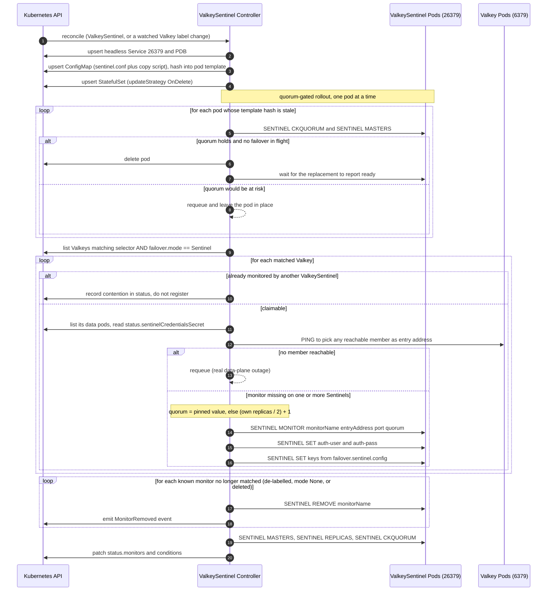
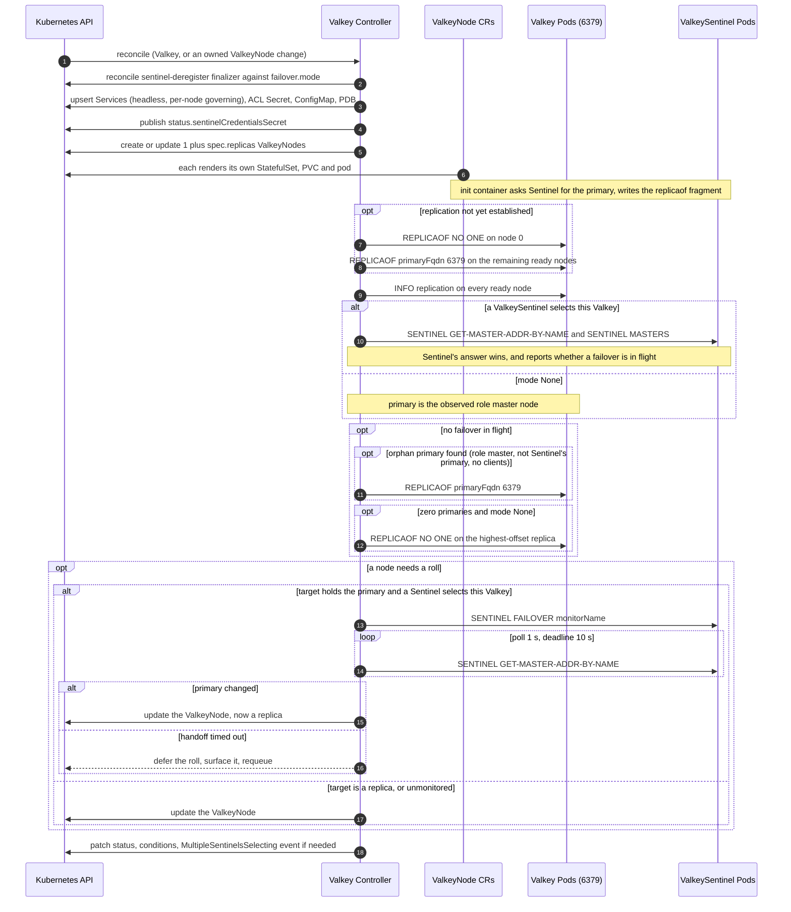

# Valkey and ValkeySentinel Design Proposal

### Revisions

Discussed in [discussion #387](https://github.com/valkey-io/valkey-operator/discussions/387). Each revision links to the document as it read at that commit. Full history: [feat/valkeysentinel-design](https://github.com/deepakpunjabi/valkey-operator/commits/feat/valkeysentinel-design/).

| Rev | Change | Document |
| --- | --- | --- |
| 1 | Initial proposal. Two CRDs, selector linkage, Sentinel as the failover authority. | [`6563529`](https://github.com/deepakpunjabi/valkey-operator/blob/6563529/docs/valkeysentinel-design.md) |
| 2 | `spec.failover` replaces `spec.sentinel`, dropping the `required` bool. <br>Boot-time discovery init container. <br>One Sentinel per instance, enforced. <br>Role-selector Services dropped. <br>Deregistration finalizer. PDB config duplicated per CRD. | [`64c67da`](https://github.com/deepakpunjabi/valkey-operator/blob/64c67da/docs/valkeysentinel-design.md) |

## Summary

This document proposes support for Valkey **replication mode with Sentinel** in the valkey-operator, alongside the existing cluster mode ([architecture.md](https://github.com/valkey-io/valkey-operator/blob/main/docs/architecture.md)).

It is written to converge with the discussion in [issue #198](https://github.com/valkey-io/valkey-operator/issues/198) and the selector-linked draft in [VALKEY_AND_SENTINEL.md](https://github.com/user-attachments/files/31247232/VALKEY_AND_SENTINEL.md) and adopts their settled decisions: two CRDs (`Valkey` + `ValkeySentinel`), Sentinel tuning as `map[string]string` passthrough rather than typed fields, `spec.replicas` counting replicas in addition to the primary, and Sentinel pods managed as a StatefulSet for the MVP. Where it differs, it says so and why. Design also tries to align with future work on [ValkeyCell CRD](https://github.com/valkey-io/valkey-operator/issues/226).


## Motivation

Today the operator supports cluster mode only ([quickstart.md](https://github.com/valkey-io/valkey-operator/blob/main/docs/quickstart.md)). Replication mode with Sentinel covers a distinct set of users:

- Workloads that need a single keyspace (no hash-slot constraints, multi-key ops and transactions across arbitrary keys, `SELECT`/multiple DBs, Lua scripts touching unrelated keys).
- Existing applications whose clients already speak the Sentinel protocol (`SENTINEL GET-MASTER-ADDR-BY-NAME`), eg. Jedis/Lettuce/go-redis/ioredis sentinel modes, Spring Data Redis, Sidekiq, etc. Migrating these to cluster mode requires client changes, which might be a deal breaker for many organizations. Migrating to a Sentinel-backed deployment is straightforward.
- Small deployments where 3 shards × 2 nodes is more infrastructure than the data warrants.
- Automated failover that does **not** depend on the operator being available.

## Goals

- One primary + N replicas managed as a single logical unit, with automated failover by a Sentinel quorum.
- Failover works while the operator is down. Sentinel(not the operator) is the failover authority.
- Reuse `ValkeyNode` for the data plane **without modifying it**. Sentinel pods are a StatefulSet for the MVP, but share the pod-template builder with `ValkeyNode` rather than duplicating it.
- Reuse existing ValkeyCluster building blocks where they transfer: ACL/system users, TLS, persistence, scheduling, exporter and config hashing. The PDB config type is duplicated per CRD rather than shared; see [PodDisruptionBudget and TLS types](#poddisruptionbudget-and-tls-types).
- **Rolling restarts are new work, not reuse.** The existing proactive handoff is `CLUSTER FAILOVER` (`performFailover`, with its TAKEOVER variant), which has no Sentinel equivalent. Because Sentinel is the failover authority, the operator must request `SENTINEL FAILOVER` and wait for Sentinel to complete it before rolling the old primary. That is a different control flow, not a parameter on the existing one. See [Planned operations](#planned-operations).
- Stable client entry points: a Sentinel endpoint for failover-aware clients, plus stable per-pod DNS. Role-selector Services are out of scope; see [Client entry points](#client-entry-points).
- HA intent is explicit. `spec.failover.mode` states who promotes, and an instance declaring `Sentinel` with nothing monitoring it is `Degraded` rather than quietly unprotected.
- Standalone (`replicas: 0`) falls out of the same CRD as a degenerate case.

## Non-Goals

- Sharding, slot management, or resharding (that is ValkeyCluster; non-cluster sharding is a future `ValkeyCell` that creates N labelled `Valkey`s).
- Migrating an existing ValkeyCluster into replication mode, or vice versa.
- Sentinel in front of a ValkeyCluster (cluster mode has its own failover).
- Cross-namespace Sentinel selection (see [Future work](#future-work)).
- Client-side proxying (no proxy pods are introduced).

### Detailed Design

## Required CRDs

| CRD | Kind of change | Purpose | User-facing |
| --- | --- | --- | --- |
| `Valkey` | **New** | Data plane: one primary + N replicas, and the Services in front of them | Yes |
| `ValkeySentinel` | **New** | Monitoring plane: a Sentinel quorum that selects and monitors one or more `Valkey`s | Yes |
| `ValkeyNode` | **Unchanged** | Data pods reuse it as-is. Two extensions were considered and deferred. See [`ValkeyNode`: no changes](#valkeynode-no-changes) | No (internal) |
| `ValkeyCluster` | Unchanged | — | Yes |

Shared API types (`SchedulingSpec`, `PersistenceSpec`, `ExporterSpec`, `UserAclSpec`, `WorkloadType`, `NetworkingSpec`, `TLSSpec`) are reused as is from `api/v1alpha1`.

### PodDisruptionBudget and TLS types

**TLS: reuse unchanged.** `NodeTLSSpec` and `TLSSpec` are not cluster-shaped. `ValkeyNode` already consumes `NodeTLSSpec`, and `ValkeyNode` is topology-agnostic. The cluster-specific part is the *defaulting*, where an unset `serverName` falls back to the cluster headless FQDN. That is controller logic, and the `Valkey` controller supplies its own fallback. No new type is needed.

**PDB: a separate type per CRD.** Each new CRD gets its own PDB config type rather than sharing `ValkeyCluster`'s. The cost is a near-duplicate struct and a generated deepcopy per CRD, since all of them live in `api/v1alpha1` and so need distinct Go names. The benefit is that the CRDs evolve independently through `v1alpha1`, which matters while `ValkeyCell` and `ValkeyPool` are still undesigned. A field added for one topology cannot leak into another's schema.

```go
// ValkeyPodDisruptionBudgetConfig manages the PDB over a Valkey's data pods.
type ValkeyPodDisruptionBudgetConfig struct {
    // +kubebuilder:validation:Enum=Managed;Disabled
    // +kubebuilder:default=Managed
    // +optional
    Mode ValkeyPDBMode `json:"mode,omitempty"`
}

// SentinelPodDisruptionBudgetConfig manages the PDB over a ValkeySentinel's pods.
type SentinelPodDisruptionBudgetConfig struct {
    // +kubebuilder:validation:Enum=Managed;Disabled
    // +kubebuilder:default=Managed
    // +optional
    Mode SentinelPDBMode `json:"mode,omitempty"`
}
```

Both render `maxUnavailable: 1` over the owning CR's pods in `Managed` mode, and delete any existing PDB in `Disabled` mode. Identical shape, identical behaviour, separate types.

Two deliberate departures from the `ValkeyCluster` type it is modelled on:

**`Managed` replaces `Cluster`.** In the current implementation `Cluster` and every unrecognised value behave identically, and only `Disabled` differs, so `Mode` is a boolean with a topology-specific name for "on". `Managed` says what it does and reads correctly on any kind. It is also already the project's word for this state, being the legacy string form the existing unmarshaller decodes. `ValkeyCluster` keeps `Cluster` unchanged; this is not a rename of the existing API.

**No custom `UnmarshalJSON`.** `PodDisruptionBudgetConfig` carries one so pre-upgrade `ValkeyCluster` objects stored as a bare string still decode, and it is marked removable at v1beta1. New CRDs have no stored objects, so the new types are plain structs.

**Fields beyond `Mode` are deferred.** `minAvailable`, `maxUnavailable` and `unhealthyPodEvictionPolicy` are all candidates, and none is needed to ship. The default is right for the common shape, and adding an optional field later is additive. `minAvailable` is the interesting one for Sentinel; see [Future work](#future-work).

**A single pod gets no PDB.** At `spec.replicas: 0` a `Valkey` is one pod, and a budget over it is either useless or harmful: `maxUnavailable: 1` permits evicting the only pod, and `maxUnavailable: 0` blocks node drains permanently. The operator creates none and records why.

The two-CRD shape is settled (see [Settled: CRD shape](#settled-crd-shape)). The live question is which side declares the link between them; this document recommends a **selector on the Sentinel side plus an explicit failover mode on the data side**. See [Linkage direction](#linkage-direction).

### `Valkey`

```go
// ValkeySpec defines the desired state of Valkey.
type ValkeySpec struct {
    // Replicas is the number of replicas in addition to the primary.
    // Semantics and defaulting match ValkeyCluster.spec.replicas exactly.
    // 0 means a lone primary. N means one primary plus N replicas.
    // +kubebuilder:validation:Minimum=0
    Replicas int32 `json:"replicas,omitempty"`

    // Failover declares how primary failover is performed for this instance.
    // +optional
    Failover *FailoverSpec `json:"failover,omitempty"`

    Image                         string                         `json:"image,omitempty"`
    ImagePullSecrets              []corev1.LocalObjectReference  `json:"imagePullSecrets,omitempty"`
    Resources                     corev1.ResourceRequirements    `json:"resources,omitempty"`
    Scheduling                    *SchedulingSpec                `json:"scheduling,omitempty"`
    Exporter                      ExporterSpec                   `json:"exporter,omitempty"`
    // WorkloadType is immutable.
    // Switching it would strand the previous workload, and its PVCs
    // in the StatefulSet case.
    WorkloadType                  WorkloadType                   `json:"workloadType,omitempty"`
    Persistence                   *PersistenceSpec               `json:"persistence,omitempty"`
    Users                         []UserAclSpec                  `json:"users,omitempty"`
    Containers                    []corev1.Container             `json:"containers,omitempty"`
    Config                        map[string]string              `json:"config,omitempty"`
    Networking                    *NetworkingSpec                `json:"networking,omitempty"`
    PodDisruptionBudget           *ValkeyPodDisruptionBudgetConfig `json:"podDisruptionBudget,omitempty"`
    PodSecurityContext            *corev1.PodSecurityContext     `json:"podSecurityContext,omitempty"`
    TerminationGracePeriodSeconds *int64                         `json:"terminationGracePeriodSeconds,omitempty"`
}

// FailoverSpec declares who is responsible for promoting a replica.
// It is deliberately self-contained and references no sibling or parent field,
// so ValkeyCell can embed the same type for the Valkeys it manages.
type FailoverSpec struct {
    // Mode selects the failover engine.
    // Values may be added in future versions; clients must handle unknown values.
    //   None     - nobody promotes automatically.
    //              A standalone instance, or manual failover.
    //   Sentinel - a ValkeySentinel quorum is the failover authority.
    //   Operator - reserved. Not implemented in this proposal.
    // +kubebuilder:validation:Enum=None;Sentinel
    // +kubebuilder:default=None
    Mode FailoverMode `json:"mode,omitempty"`

    // Sentinel configures Sentinel-mode failover.
    // Only valid when mode is Sentinel.
    // This block does not by itself cause monitoring.
    // A ValkeySentinel must also select this object.
    // +optional
    Sentinel *SentinelFailoverSpec `json:"sentinel,omitempty"`
}

type FailoverMode string

const (
    FailoverModeNone     FailoverMode = "None"
    FailoverModeSentinel FailoverMode = "Sentinel"
)

// MonitorName resolves the effective Sentinel master-name.
// Shared so the Valkey and ValkeySentinel controllers cannot disagree.
func (v *Valkey) MonitorName() string {
    if v.Spec.Failover != nil && v.Spec.Failover.Sentinel != nil &&
        v.Spec.Failover.Sentinel.MonitorName != "" {
        return v.Spec.Failover.Sentinel.MonitorName
    }
    return v.Name
}

// +kubebuilder:validation:XValidation:rule="has(self.monitorName) == has(oldSelf.monitorName)",message="monitorName cannot be added or removed after the sentinel block is created"
// +kubebuilder:validation:XValidation:rule="!has(self.monitorName) || self.monitorName == oldSelf.monitorName",message="monitorName is immutable"
type SentinelFailoverSpec struct {
    // MonitorName is the Sentinel master-name for this instance.
    // Defaults to metadata.name, resolved by Valkey.MonitorName().
    // There is no kubebuilder default, because a materialized default
    // cannot be distinguished from a user-set value by the rules above.
    // It stays settable so an adopted deployment keeps the master-name
    // its clients already use.
    // +kubebuilder:validation:MinLength=1
    // +optional
    MonitorName string `json:"monitorName,omitempty"`

    // Quorum is the number of Sentinels that must agree the primary is down.
    // Passed to SENTINEL MONITOR.
    // Defaults to (selecting sentinel's replicas / 2) + 1.
    // The default is computed at registration time.
    // Set it explicitly to pin it.
    // +kubebuilder:validation:Minimum=1
    // +optional
    Quorum *int32 `json:"quorum,omitempty"`

    // Config is per-master Sentinel tuning.
    // Forwarded as SENTINEL SET <monitorName> <key> <value>.
    // Values are not validated by the operator.
    // Operator-owned keys are skipped with a ConfigurationWarning.
    // +optional
    Config map[string]string `json:"config,omitempty"`
}

// ValkeyStatus defines the observed state of Valkey.
type ValkeyStatus struct {
    // State is a high-level summary
    // Initializing, Reconciling, Ready, Degraded, Failed
    State   ValkeyState `json:"state,omitempty"`
    Reason  string      `json:"reason,omitempty"`
    Message string      `json:"message,omitempty"`

    // Primary is the ValkeyNode currently serving as primary.
    Primary string `json:"primary,omitempty"`

    // PrimaryAddress is the address clients should write to.
    PrimaryAddress string `json:"primaryAddress,omitempty"`

    Replicas       int32 `json:"replicas,omitempty"`
    ReadyReplicas  int32 `json:"readyReplicas,omitempty"`
    SyncedReplicas int32 `json:"syncedReplicas,omitempty"`

    // Monitoring reports which ValkeySentinels monitor this instance.
    Monitoring *MonitoringStatus `json:"monitoring,omitempty"`

    // SentinelCredentialsSecret locates the _sentinel user's password.
    // It is the only credential a selecting ValkeySentinel reads.
    SentinelCredentialsSecret *corev1.SecretKeySelector `json:"sentinelCredentialsSecret,omitempty"`

    ObservedGeneration int64              `json:"observedGeneration,omitempty"`
    Conditions         []metav1.Condition `json:"conditions,omitempty"`
}

type MonitoringStatus struct {
    // MonitoredBy lists the ValkeySentinels currently selecting this instance.
    // At most one is permitted.
    // A second selector is rejected and reported as Degraded.
    MonitoredBy []string `json:"monitoredBy,omitempty"`
    MonitorName string   `json:"monitorName,omitempty"`
    // Registered is true when every ready pod of the selecting
    // ValkeySentinel reports this monitor.
    Registered      bool  `json:"registered,omitempty"`
    Quorum          int32 `json:"quorum,omitempty"`
    AvailableQuorum int32 `json:"availableQuorum,omitempty"`
}
```

Conditions (following [status-conditions.md](https://github.com/valkey-io/valkey-operator/blob/main/docs/status-conditions.md)): `Ready`, `Progressing`, `Degraded`, `ConfigurationWarning`, plus:

- `PrimaryElected`: Exactly one node reports `role:master`.
- `ReplicationHealthy`: Every replica reports `master_link_status:up`.
- `Monitored`: A `ValkeySentinel` selects this instance and has registered the monitor. It participates in `Ready` when `spec.failover.mode` is `Sentinel`, because in that mode the user has declared Sentinel to be the failover authority. An instance in mode `Sentinel` with no selecting Sentinel has no failover authority at all, so it is `Degraded`. In mode `None` the condition is not set.
- `SentinelQuorumHealthy`: `SENTINEL CKQUORUM <monitorName>` succeeds, meaning there are enough Sentinels to both detect failure and authorize failover. An instance can be `Monitored` while this is False. That instance will not fail over, so the condition exists to surface the gap.

`spec.failover.mode` replaces the `required` bool from the earlier draft. Declaring the mode already states the intent, so a second field asserting it is redundant. The mode also carries information the bool could not: it distinguishes "nobody promotes" from "Sentinel promotes" from a future "the operator promotes", and it gives the Sentinel side something to filter on.

Validation:

| Rule | Enforcement |
| --- | --- |
| `failover.sentinel` present requires `failover.mode: Sentinel` | CEL reject |
| `failover.sentinel.monitorName` cannot be added or removed once the sentinel block exists | CEL transition |
| `failover.sentinel.monitorName` value is immutable | CEL transition |
| `persistence` immutability, expand-only, and the `Deployment` exclusion | CEL, copied from `ValkeyClusterSpec` |
| `workloadType: Deployment` with `replicas > 0` | CEL reject |
| `workloadType` itself | CEL immutable |
| `failover.mode: Sentinel` with `replicas: 0` | `ConfigurationWarning`, not reject |
| Even `ValkeySentinel.spec.replicas` | `ConfigurationWarning`, not reject |
| `failover.sentinel.quorum` versus the selecting Sentinel's size | Registration-time check, `ConfigurationWarning` |

Notes on the three that are not plain rejections:

- **`mode: Sentinel` with `replicas: 0` is legal.** Sentinel can monitor a single node. It cannot fail it over, but it still tracks liveness, and the instance may be scaled up later. Rejecting this would also make `replicas: 0` to `replicas: 1` a two-step edit. A warning says the instance is monitored but unprotected.
- **Even Sentinel replica counts are legal.** Four Sentinels need 3 for majority, the same as five, so the fourth pod adds a failure domain and no authority. That is wasteful rather than wrong, so it warns.
- **`quorum` cannot be CEL-validated**, because the Sentinel's replica count lives on a different object. It is checked when the monitor is registered. The operator warns when the value exceeds the available Sentinel count, or when it falls at or below half of it.

**No validating webhook.** Every rule above is expressible as CEL on the CRD, and the repository currently ships no webhook, so adding one would introduce cert management, a service, and a failure mode where the API server rejects writes when the operator is down. That last point matters more than usual here, because this design's central promise is that failover survives the operator being unavailable. A webhook would make the API surface depend on the operator even though the data plane does not. The cross-object rules that CEL cannot express, quorum sizing and one-Sentinel-per-instance, both need live state from other objects, so a webhook could not decide them reliably either. They belong in the controller. Revisit only if a rule appears that is genuinely cross-object, synchronous, and safety-critical.

### `ValkeySentinel`

```go
// ValkeySentinelSpec defines a Sentinel quorum and what it monitors.
type ValkeySentinelSpec struct {
    // Replicas is the number of Sentinel pods. Minimum is 3.
    // An even count raises a ConfigurationWarning rather than being rejected.
    // It adds a failure domain without raising the majority threshold.
    // +kubebuilder:validation:Minimum=3
    // +kubebuilder:default=3
    Replicas int32 `json:"replicas,omitempty"`

    // ValkeySelector selects the Valkeys in this namespace to monitor.
    // A candidate must also declare spec.failover.mode == Sentinel.
    // Both sides must agree.
    // An empty selector matches nothing rather than everything.
    // Matching everything would silently enroll unintended instances.
    // +optional
    ValkeySelector *metav1.LabelSelector `json:"valkeySelector,omitempty"`

    // Exporter runs a metrics sidecar against the Sentinel port.
    // Sentinel speaks RESP and has no HTTP endpoint of its own.
    // Scraping therefore needs the same sidecar pattern the data nodes use.
    // +optional
    Exporter ExporterSpec `json:"exporter,omitempty"`

    // Config is process-global sentinel.conf tuning, written to the file as is.
    // Per-master options belong on the Valkey CR, under
    // spec.failover.sentinel.config, and are applied via SENTINEL SET.
    // Operator-owned directives win over user keys.
    // A collision raises a ConfigurationWarning.
    // +optional
    Config map[string]string `json:"config,omitempty"`

    Image              string                        `json:"image,omitempty"`
    ImagePullSecrets   []corev1.LocalObjectReference `json:"imagePullSecrets,omitempty"`
    Resources          corev1.ResourceRequirements   `json:"resources,omitempty"`
    Scheduling         *SchedulingSpec               `json:"scheduling,omitempty"`
    Containers         []corev1.Container            `json:"containers,omitempty"`
    Networking         *NetworkingSpec               `json:"networking,omitempty"`
    PodSecurityContext *corev1.PodSecurityContext    `json:"podSecurityContext,omitempty"`

    // Persistence for Sentinel's rewritten config. It is optional.
    // Sentinel state is reconstructable from re-registration plus gossip.
    // +optional
    Persistence *PersistenceSpec `json:"persistence,omitempty"`

    // PodDisruptionBudget defaults to Managed.
    // That gives maxUnavailable: 1 over this Sentinel's pods.
    // +optional
    PodDisruptionBudget *SentinelPodDisruptionBudgetConfig `json:"podDisruptionBudget,omitempty"`
}

type ValkeySentinelStatus struct {
    State         SentinelState `json:"state,omitempty"`
    Reason        string        `json:"reason,omitempty"`
    Message       string        `json:"message,omitempty"`
    Replicas      int32         `json:"replicas,omitempty"`
    ReadyReplicas int32         `json:"readyReplicas,omitempty"`

    // Monitors is the live view from SENTINEL MASTERS across ready pods.
    // It is intersected with the current selector match.
    Monitors []MonitorStatus `json:"monitors,omitempty"`

    ObservedGeneration int64              `json:"observedGeneration,omitempty"`
    Conditions         []metav1.Condition `json:"conditions,omitempty"`
}

type MonitorStatus struct {
    // Name is the monitor (master) name, and Valkey is the CR it came from.
    Name   string `json:"name"`
    Valkey string `json:"valkey,omitempty"`

    PrimaryAddress string `json:"primaryAddress,omitempty"`
    Quorum         int32  `json:"quorum,omitempty"`
    
    // OK is the result of SENTINEL CKQUORUM.
    OK bool `json:"ok,omitempty"`
    // Replicas is the replica count Sentinel itself discovered.
    // It can lag or differ from Valkey.status.readyReplicas.
    Replicas int32 `json:"replicas,omitempty"`
}
```

### `ValkeyNode`: no changes

Data pods use `ValkeyNode` exactly as it exists today. Two extensions were considered and both are deferred.

**A per-node config hint (`spec.replicaOf`), not needed.** Replication mode needs each pod's effective config to differ. Node 0 carries no `replicaof` and the rest point at the current primary. The shared-ConfigMap wiring cannot express that. The parent renders one ConfigMap for the whole set and stamps that same name onto every node via `ServerConfigMapName`. The node controller then skips creating its own and mounts the shared one. It is launched by a fixed command with no shell to substitute into. Every pod in a set therefore mounts identical config.

A per-node CRD field was the earlier answer. It is no longer the proposed one. The [boot-time discovery init container](#boot-time-discovery) solves the same problem without changing `ValkeyNode`'s API, and solves it better: a field written by the operator records what the operator last believed, whereas the init container asks Sentinel what is true at the moment the pod starts. After a failover the field would be stale and the query is not.

This matters because of what the alternative costs. Without either mechanism, replication is runtime-only state. `CONFIG REWRITE` cannot persist it, since the config is a read-only ConfigMap mount. A pod that restarts from a node drain, an upgrade, an eviction or an OOM kill comes back as its own primary. Because it is not replicating, it never appears in the real primary's `INFO replication`, which is exactly where Sentinel discovers replicas. Sentinel cannot see it, so Sentinel cannot fix it, and repair falls to the operator. That is the one dependency this design exists to remove.

**Sentinel as a `ValkeyNode`, deferred.**

`ValkeyNode` is defined around a Valkey server pod. Its `status.role` is primary or replica, it reports replication state, and it owns a PVC. The singleton-per-pod shape exists so each data pod can be scheduled independently. Sentinel pods are interchangeable, need no PVC, and want no per-pod scheduling divergence. Three identical pods is what a StatefulSet does best. Adopting `ValkeyNode` would buy pod-template reuse and naturally quorum-gated rolls. Both are obtainable more cheaply, by sharing the template builder and using `updateStrategy: OnDelete`. Revisit when `ValkeyNode` grows alternate-binary, alternate-port, and no-PVC support.

One thing about `ValkeyNode` that this design depends on and must not change: **PVCs are resolved by name** through `valkeyNodePVCName`, not by label selector. That is what makes sharing the pod-template builder with Sentinel safe. If the lookup were ever generalised to label selectors, Sentinel pods would match the data-volume selectors and the operator could claim or delete the wrong PVC. Any future refactor of the shared builder has to preserve name-based resolution.

### Boot-time discovery

Every `ValkeyNode` created by a `Valkey` carries an init container, in all failover modes, including `None`. It runs before the server and writes an `include`d config fragment into the pod's writable volume.

In `Sentinel` mode it resolves the Sentinel headless Service, calls `SENTINEL GET-MASTER-ADDR-BY-NAME <monitorName>`, and writes `replicaof <host> <port>`. A pod therefore rejoins as a replica of whoever is primary *now*, not whoever was primary when the operator last wrote config. That closes the orphan-primary case without the operator being involved, which is the whole point.

Three design constraints, in order of how easily they are got wrong:

**It must exist from the first release, on every node, unconditionally.** Adding or removing a container mutates the pod template, and a template change rolls every pod. If the container appeared only in `Sentinel` mode, then `None` to `Sentinel` would roll the entire set, which is exactly the cheap transition [mode transitions](#failover-mode-transitions) needs. An always-present container makes a mode change a ConfigMap write. In `None` mode it writes an empty fragment and exits, costing a few hundred milliseconds at boot.

**The script lives in the ConfigMap, not in the container command.** ConfigMap content changes do not alter the pod template, so the operator can change discovery logic without rolling pods. The repository already depends on this property for server config, where the ConfigMap is deliberately excluded from the pod-template roll hash. This extends it from config to boot logic.

**Failure must not start a primary.** If no Sentinel answers, the init container fails and the pod stays in `Init`, retrying with backoff. A pod stuck initializing is visible and harmless. A pod that booted as an unintended primary accepts writes that later have to be discarded. The one exception is first bootstrap, when no monitor exists yet: the pod at ordinal 0 writes an empty fragment and becomes the initial primary, and every other ordinal waits for a monitor to exist. That keeps the bootstrap rule in one place instead of spreading it across the controller.

The fragment is a separate file pulled in by an `include` at the end of the shared `valkey.conf`, rather than an edit to `valkey.conf` itself. The operator keeps ownership of the main file, the include target always exists (empty for the initial primary, or startup fails), and the shared ConfigMap and its hash are untouched. The image needs `valkey-cli`, so it reuses the server image and adds no second pull.

Scope note: the same mechanism is wanted on `ValkeyCluster` nodes for general pre-boot logic. This design ships it for `Valkey` only. Building it on the shared pod-template builder keeps that extension cheap, but whether `ValkeyCluster` adopts it is a separate change with its own rollout consequences, since adding the container there rolls every existing cluster once.

## Configuration surface

Sentinel's knobs split across three apply paths. A single flat map hides that distinction. Where each key belongs:

| Category | Examples | Apply path | Where it lives |
| --- | --- | --- | --- |
| Structural | `monitor`, quorum | `SENTINEL MONITOR` | Operator only. `Valkey.spec.failover.sentinel.quorum` supplies the quorum argument |
| Per-master runtime | `down-after-milliseconds`, `failover-timeout`, `parallel-syncs`, `notification-script` | `SENTINEL SET <master>` | `Valkey.spec.failover.sentinel.config` |
| Credentials | `auth-user`, `auth-pass`, `sentinel-user`, `sentinel-pass` | `SENTINEL SET` / `sentinel.conf` | Operator only, from the ACL Secret |
| Process-global | `resolve-hostnames`, `announce-hostnames`, `announce-ip`, `announce-port` | `sentinel.conf` | `ValkeySentinel.spec.config`, with operator-owned keys reserved |

Two maps rather than one, because per-master and process-global directives have genuinely different scopes and apply paths. A design with only a `SENTINEL SET` oriented map leaves no way to set a process-global directive at all.

Typed fields were considered and rejected. Sentinel's directive set is very stable. The core has been unchanged since Redis 2.8, with roughly one or two additions per major release and no removals (`deny-scripts-reconfig` in 5.0, `sentinel-user` and `sentinel-pass` in 5.0.1, `auth-user` in 6.0, `resolve-hostnames` and `announce-hostnames` in 6.2, `master-reboot-down-after-period` in 7.0). So churn is not the argument. The real arguments are that `ValkeyCluster.spec.config` already set this precedent, that the operator has no business validating Valkey's ranges, and that a map which later grows a few typed fields is additive. Typed fields that turn out wrong are a v1alpha1 to v1beta1 break.

Operator-owned key handling follows the existing `getBaseConfig` precedent for file-rendered config, where base directives are written last and win. A collision raises a `ConfigurationWarning` so the override is visible rather than silent. For `SENTINEL SET` config there is no file ordering, so reserved keys are skipped and warned about instead.

Per-master keys are written to both places. `SENTINEL SET` applies them live, and the same values are rendered into the Sentinel ConfigMap so a restarted Sentinel pod does not lose them before re-registration catches up. Sentinel's own `CONFIG REWRITE` also persists them into `/data/sentinel.conf`, but that file is lost with an emptyDir, so the ConfigMap is the durable copy.

## Failover mode transitions

Changing `spec.failover.mode` is not modelled as a state machine, and there is no table of permitted transitions. The controller compares desired mode against observed registration on every reconcile and closes the gap. Four cases, from a two-value cross product:

| Desired | Observed | Action |
| --- | --- | --- |
| `Sentinel` | not registered | `SENTINEL MONITOR`, then `SENTINEL SET` for credentials and per-master keys |
| `Sentinel` | registered | Diff the live `SENTINEL MASTERS` view and re-apply drifted `SENTINEL SET` values |
| `None` | registered | `SENTINEL REMOVE` on every Sentinel pod, then drop `Monitored` |
| `None` | not registered | Nothing |

This is why `mode` is better than the `required` bool it replaces. Desired state is self-describing, so the controller never has to ask what the mode used to be.

Both directions rely on idempotency rather than on ordering. `SENTINEL REMOVE` for an unknown name and `SENTINEL MONITOR` for an already-monitored name are both treated as success, so a partial application converges on retry. Partial application is the real hazard: removing a monitor from two of three Sentinels leaves the third able to trigger a failover on an instance that is no longer supposed to have one.

`None` does not tear down replication. The pods keep their current primary and replica relationships, and the init container keeps writing the last known primary. What changes is that nobody promotes automatically. Tearing down replication on a mode change would turn a monitoring decision into a data-plane event, and a user flipping to `None` to rename a monitor (see below) would get an unexpected topology reset.

Renaming a monitor is possible through `Sentinel` to `None` to `Sentinel` with a new `monitorName`. The CEL rules freeze the name while the sentinel block exists, and this path is the deliberate escape hatch. It is a teardown and re-registration, with an unmonitored window in between, so it is documented rather than blocked.

### Contention between Sentinels

**At most one `ValkeySentinel` may monitor a `Valkey`.** The earlier draft allowed several and emitted a warning, on the grounds that their per-master `SENTINEL SET` values race and the last applied wins. Permitting a configuration whose outcome is decided by reconcile order is not a good default, so the first iteration rejects it.

CEL cannot express this, since it spans objects. The `Valkey` controller counts the `ValkeySentinel`s selecting it. More than one means `Monitored=False`, `Degraded`, and a `MultipleSentinelsSelecting` event naming all of them. The instance keeps running under whichever Sentinel registered first, so an accidental second selector does not remove HA. Sentinel-side, a `ValkeySentinel` that finds a candidate already monitored by another declines to register it and reports it in status, so two controllers cannot both claim the same monitor.

Selection requires agreement from both sides. A `ValkeySentinel` matches a `Valkey` only when its `valkeySelector` matches the labels **and** the `Valkey` declares `spec.failover.mode: Sentinel`. Label matching alone would let a Sentinel claim an instance whose owner intended a different failover authority, which matters once an `Operator` mode exists.

Migrating an instance between Sentinels is not designed yet. The mechanical path is to relabel, which deregisters from the old Sentinel and registers with the new one, leaving a brief unmonitored window. Whether that window needs closing with an overlap protocol is deferred.

## Topology

```
Valkey "auth-cache"            labels: {tier: caching}
├── ValkeyNode auth-cache-0        (primary)
├── ValkeyNode auth-cache-1        (replica)
├── ValkeyNode auth-cache-2        (replica)
├── Service valkey-auth-cache            (headless, all members)
├── Service valkey-auth-cache-0/-1/-2    (per-node governing Services, for stable pod DNS)
├── ConfigMap valkey-auth-cache          (valkey.conf + probe scripts)
├── Secret internal-auth-cache-acl                (ACL file, incl. _sentinel)
├── Secret internal-auth-cache-system-passwords   (system user passwords)
└── PodDisruptionBudget valkey-auth-cache

Valkey "session-store"         labels: {tier: caching}
Valkey "rate-limits"           labels: {tier: caching}

ValkeySentinel "monitors"
  spec.replicas: 3
  spec.valkeySelector.matchLabels: {tier: caching}
├── StatefulSet valkey-sentinel-monitors   (3 pods, updateStrategy: OnDelete)
├── Service valkey-sentinel-monitors       (headless, 26379, publishNotReadyAddresses)
├── ConfigMap valkey-sentinel-monitors     (sentinel.conf template + copy script)
└── PodDisruptionBudget valkey-sentinel-monitors  (maxUnavailable: 1)

This monitors all three Valkeys from one 3-pod quorum.
```

Data node names follow the existing convention with the shard dimension dropped, so `<name>-<index>`, with index 0 being the *initial* primary. As in cluster mode, that index is a bootstrap fact rather than live truth. The live role is always read from `INFO replication` or from Sentinel.

`SENTINEL MONITOR` uses the name resolved by `Valkey.MonitorName()`, which defaults to the `Valkey`'s `metadata.name`. Namespace-scoped name uniqueness makes collisions structurally impossible in the default case.

### Client entry points

Two, both operator-independent:

1. **`valkey-sentinel-<name>`**: A headless Service over the Sentinel pods on 26379. Sentinel-aware clients use this and get instant, operator-independent failover awareness. **This is the supported path for writes.**
2. **`valkey-<name>`**: The set-wide headless Service over all members, plus the per-node governing Services that give each pod a stable FQDN. This is the existing pattern in the repository and is what Sentinel itself resolves.

**Role-selector Services are deliberately out of scope.** An earlier draft proposed `valkey-<name>-primary` and `valkey-<name>-replicas`, ClusterIP Services whose endpoints followed a `valkey.io/role` pod label the operator maintained. The motivation was clients that cannot speak the Sentinel protocol. That motivation does not survive inspection: every client named in [Motivation](#motivation) supports Sentinel natively, which is the reason those users want this topology in the first place.

Dropping them removes real cost and real risk:

- The `valkey.io/role` label, which does not exist in the repository today, and the `patch` verb on pods it requires.
- An endpoint that is only eventually correct. Convergence was bounded by reconcile latency, so a write Service that lags a failover can point at a demoted primary.
- A second, operator-dependent path to the primary, in a design whose premise is that the operator is not on the failover path.

The residual case is a genuinely Sentinel-unaware client. Revisit after implementation, with a concrete client that needs it. Per-pod Services are also wanted for `ValkeyCluster` and that design is not settled, so the right move is to converge on one approach rather than inventing a second here.

## Why per-pod DNS?

Sentinel discovers replicas by parsing `INFO replication` on the primary and by gossiping over `__sentinel__:hello`. It persists the resolved addresses in its own rewritten config. On Kubernetes, pod IPs change on every restart, so an IP-based setup leaves Sentinel holding dead addresses.

Resolution: use stable DNS names everywhere and let Sentinel resolve them.

- Servers get `replica-announce-ip <pod-fqdn>` and `replica-announce-port 6379`.
- Sentinels get `sentinel announce-ip <pod-fqdn>` / `announce-port`.
- Sentinel config sets `sentinel resolve-hostnames yes` and `sentinel announce-hostnames yes`, and monitors are registered by hostname rather than IP.

**Per-pod DNS does not exist in this repository today, and this design has to add it.** Each `ValkeyNode`'s StatefulSet sets `spec.serviceName` to its own resource name. Nothing ever creates a Service by that name. The only Service is the parent's set-wide headless one, and the operator reaches pods by `status.podIP`, using the headless FQDN solely as a TLS `serverName`. The `Valkey` controller therefore has to create one headless governing Service per node, matching the name the StatefulSet already points at. The resulting FQDN is `valkey-<name>-<i>-0.valkey-<name>-<i>.<ns>.svc.cluster.local`. Note that the subdomain is the per-node Service, not the set-wide one.

Stable identity also requires `workloadType: StatefulSet`. **`Deployment` is rejected whenever `spec.replicas > 0`.** A selecting `ValkeySentinel` also refuses to monitor a Deployment-backed instance. It emits a warning rather than registering a monitor it cannot address durably. The gate is on `replicas` rather than on `spec.failover`, because replication needs stable identity whether or not anything monitors it. A standalone `replicas: 0` cache on a Deployment stays legal, since there is no replication to preserve and nothing to fail over. Cluster mode tolerates Deployments because `CLUSTER MEET` and nodes.conf re-converge on IP changes through the operator. Sentinel has no equivalent operator-mediated repair path.

Hostname resolution support must be pinned in docs. It comes from the Redis 6.2 lineage and is present in Valkey. The reconciler surfaces a `ConfigurationWarning` if the image reports an older version.

## Sentinel pod specifics

- **Writable config.** Sentinel rewrites its own config, calling `CONFIG REWRITE` on every monitor or failover change, and a ConfigMap mount is read-only. So the pod copies `sentinel.conf` from the ConfigMap into `/data/sentinel.conf` at startup, using an init container or an entrypoint copy, then runs `valkey-sentinel /data/sentinel.conf`. `/data` is an emptyDir by default, or a PVC when `spec.persistence` is set. This keeps `readOnlyRootFilesystem: true` intact, a posture already asserted by the read-only rootfs e2e suite.
- **Losing `/data` is safe** but not free. A restarted Sentinel with an empty config re-learns monitors from re-registration and the rest from gossip. It does not count toward quorum during that window. Default to emptyDir and document the PVC option.
- **Credential contract.** Sentinel needs credentials for every monitored server, via `SENTINEL SET <name> auth-user` and `auth-pass`. When the Sentinels themselves require auth, it also needs `sentinel-user` and `sentinel-pass` for inter-Sentinel traffic. This adds a `_sentinel` system user alongside `_operator`, `_exporter`, and `_replication`. Its ACL rawstring comes from the [Valkey ACL docs for Sentinel and replicas](https://valkey.io/topics/acl/#acl-rules-for-sentinel-and-replicas), the same source already cited for the replication user. The exact rawstring must be validated against the target Valkey version before merge. It needs at minimum `+multi +exec +ping +info +role +publish +subscribe +replicaof +config|rewrite +client|setname +client|kill +script|kill` and `allchannels`. The `Valkey` controller creates the user and publishes its location in `status.sentinelCredentialsSecret`. In practice that is `internal-<name>-system-passwords`, key `_sentinel`, following `getSystemPasswordSecretName`. The ACL file itself lives in `internal-<name>-acl` and user-supplied passwords in `<name>-users`. A selecting `ValkeySentinel` controller reads only the Secret and key named in status. Without this contract, a selector-linked design implicitly grants the Sentinel controller read access to every matched instance's ACL Secret, with no defined boundary.
- **TLS.** Sentinel gets `tls-port 26379`, `port 0`, and the same cert Secret as the servers it monitors. Monitors are registered against the servers' TLS port. Mixed TLS and non-TLS across one Sentinel's selected set is rejected, because a single Sentinel process cannot speak both.
- **Not `CONFIG SET`-managed.** The `liveConfigAllowlist` path is for data nodes. Sentinel's live changes go through `SENTINEL SET`.
- **Default pod anti-affinity.** Three Sentinels on one node is a quorum that one node failure destroys, which defeats the point of running three. The controller therefore injects a `preferredDuringSchedulingIgnoredDuringExecution` anti-affinity rule over `kubernetes.io/hostname`, keyed on this `ValkeySentinel`'s pod labels, whenever `spec.scheduling` does not already define pod anti-affinity. Preferred rather than required, so a 3-pod quorum still schedules on a single-node test cluster or a 2-node cluster. A user-supplied rule always wins, including a required one for production. Worth applying the same default to `Valkey` data pods, where co-locating a primary and its replicas has the same flaw.
- **Metrics.** An exporter sidecar scrapes the Sentinel port, per `spec.exporter`. `oliver006/redis_exporter` reads `INFO` from Sentinel and exposes `sentinel_masters`, `sentinel_tilt`, and per-monitor status. The `_exporter` ACL rawstring is cluster-shaped today. It grants `+cluster|info`, `+cluster|slots` and `+cluster|nodes` and no `+sentinel`, so the copy used for Sentinel needs the `sentinel` subcommands the exporter calls and can drop the cluster ones. Sentinel runs a reduced command table, so whether `ACL SETUSER` works against a Sentinel instance at the minimum supported Valkey version must be verified before merge. Sentinel metrics answer "can a failover happen right now". Node-level metrics still come from the data pods' own sidecars, so both are needed.

## Reconcile flow

### ValkeySentinel controller

Owns the monitoring plane and every monitor-lifecycle command.

1. Upsert the headless Service on 26379, with `publishNotReadyAddresses: true` so Sentinels can gossip before readiness. Upsert the PDB with `maxUnavailable: 1`, which is exactly the quorum floor at the default 3 replicas. It is not the floor at every size; see [Future work](#future-work).
    - Warn on an even `spec.replicas`, which buys a failure domain and no extra authority.
    - Inject default pod anti-affinity unless the user supplied their own.
2. Upsert the ConfigMap holding the `sentinel.conf` base directives, `spec.config`, and the copy script. Hash it into the pod template annotation, reusing the existing config-hash mechanism.
3. Upsert the StatefulSet with `updateStrategy: OnDelete`, so pod replacement order is the operator's decision rather than the StatefulSet controller's.
4. Roll pods one at a time. Delete the next only while `SENTINEL CKQUORUM` passes for every monitor and no failover is in progress, meaning `SENTINEL MASTERS` reports a `failover_state` of none throughout. This is stricter than the data-plane rule. Rolling two Sentinels concurrently in a 3-pod quorum makes failover impossible for the duration.
5. List `Valkey`s in the namespace matching `spec.valkeySelector` **and** declaring `spec.failover.mode: Sentinel`. Skip any already monitored by a different `ValkeySentinel`, recording it in status rather than competing for it. For each remaining match:
    - Choose an entry address. Use any reachable pod of that `Valkey`, not `Valkey.status.primary`. Sentinel follows `INFO replication` from any member to find the real primary. That avoids a cross-CR status dependency, and the bootstrap race where status is not yet populated. This mechanic is adopted from the selector draft, where it is a better fit than pushing the observed primary. If no pod is reachable, requeue.
    - Resolve the quorum. Use `spec.failover.sentinel.quorum` when the `Valkey` pins it, otherwise compute `(spec.replicas / 2) + 1` from this Sentinel's own replica count. The default is computed here, at registration time, rather than materialized as a CRD default, because it depends on the selecting Sentinel's size and two differently sized Sentinels would otherwise need different defaults for the same object.
    - Issue `SENTINEL MONITOR <monitorName> <entry-address> <port> <quorum>` on any ready pod missing the monitor. Then issue `SENTINEL SET` for the credentials, plus every key in the `Valkey`'s `spec.failover.sentinel.config`. This stays idempotent by diffing against the live `SENTINEL MASTERS` view first.
6. Find every monitor a Sentinel knows about that no longer matches, whether from a de-labelled `Valkey`, a `Valkey` that moved to `mode: None`, or a deleted one, and issue `SENTINEL REMOVE <name>` on every pod. A relabel or a mode change is an intentional opt-out, so there is no grace period. It is still recorded as an event, because it silently removes HA.
7. Write `status.monitors` from `SENTINEL MASTERS`, `SENTINEL REPLICAS` and `SENTINEL CKQUORUM` across ready pods.

Watches `Valkey` objects so a label change reconciles monitoring within one event hop.

The same flow as a sequence:



### Valkey controller

Owns the data plane. It issues no monitor-lifecycle commands. Its only Sentinel interaction is the planned-failover trigger, because it is the controller that rolls pods.

1. Reconcile the `valkey.io/sentinel-deregister` finalizer against `spec.failover.mode`. See [Deletion and cleanup](#deletion-and-cleanup).
2. Upsert the headless Service, the per-node governing Services, the ACL Secret including `_sentinel`, the server ConfigMap including the init script, and the PDB. All reuse the ValkeyCluster helpers except the per-node governing Services, which are new. Publish `status.sentinelCredentialsSecret`.
3. Create or update `1 + spec.replicas` ValkeyNodes, all sharing one ConfigMap, each with the [boot-time discovery](#boot-time-discovery) init container. Replication is established by the init container at pod start and by command when a pod becomes ready without one having run, so the two paths agree on the same source of truth.
4. Read live state. Run `INFO replication` on every ready node. When `status.monitoring.monitoredBy` is non-empty, also run `SENTINEL GET-MASTER-ADDR-BY-NAME` against the selecting Sentinel. The primary is **Sentinel's answer** when monitored, and the observed `role:master` node otherwise.
5. Repair only what Sentinel cannot, and only while no failover is in progress:
    - A node reporting `role:master` that is not Sentinel's primary and has no clients gets `REPLICAOF <primary>`. This covers the split-brain rejoin, and it is the backstop for an orphan primary that the init container did not catch, for instance a container restart in place that does not re-run init containers. It is no longer the *only* thing that repairs the orphan case, which is what [boot-time discovery](#boot-time-discovery) changed. It still cannot be dropped, because refusing to re-issue `REPLICAOF` after bootstrap leaves the set permanently short a replica.
    - Zero primaries and `mode: None` means promote the best-synced ready node, using the highest-offset replica. In `mode: Sentinel` with a selecting Sentinel, do nothing. The election is Sentinel's.
    - Never target Sentinel's chosen primary. Fighting Sentinel is this design's principal failure mode. Every topology write is gated on `SENTINEL MASTERS` reporting no in-flight failover.
6. Compute `Monitored` from the `ValkeySentinel`s selecting this object. Zero selectors while `mode: Sentinel` means `Monitored=False` and `Degraded`. More than one means `Degraded` with a `MultipleSentinelsSelecting` event, per [Contention between Sentinels](#contention-between-sentinels).
7. Update status and conditions.

The same flow as a sequence, including the planned-roll branch described in [Planned operations](#planned-operations):



### Planned operations

Both planes use `updateStrategy: OnDelete`, so the operator decides replacement order rather than the StatefulSet controller. `OnDelete` on its own is only permission to control the order. It supplies no ordering logic and no safety, so each roll below states its own gate.

- **Rolling a Sentinel pod.** One at a time. Delete the next only while `SENTINEL CKQUORUM` passes for every monitor and `SENTINEL MASTERS` reports `failover_state: none`. The wait condition for "rejoined" is **not** pod readiness. A Sentinel can pass its probe while still learning monitors from gossip, and during that window it does not count toward quorum (see [Sentinel pod specifics](#sentinel-pod-specifics)). The replacement counts as rejoined once it reports every expected monitor in its own `SENTINEL MASTERS` and `CKQUORUM` passes when queried against *it*. Query the gate from a pod that is not the deletion target, since a pod about to be removed has the least reliable view. This is why default `RollingUpdate` is insufficient: it advances on readiness, which is the wrong signal, and it would walk the quorum below majority during exactly the window a data node might be failing over.
- **Rolling a replica.** One at a time, gated on `master_link_status:up` for the remaining replicas.
- **Rolling the primary.** Hand off first, mirroring `internal/controller/failover.go` but with `SENTINEL FAILOVER <monitorName>` instead of `CLUSTER FAILOVER`. Sentinel must perform the promotion so that its view and the operator's stay consistent. Poll `SENTINEL GET-MASTER-ADDR-BY-NAME` on a 1 second tick with a 10 second deadline until it changes, then roll the old primary, which is now a replica. The timeout is **not** soft. If the handoff does not complete, the roll is deferred and surfaced. Rolling the primary anyway would drop writes for up to `down-after-milliseconds` and risk the orphan case above.
- **Rolling the primary of an unmonitored instance.** Promote the best-synced replica with `REPLICAOF NO ONE`, repoint the others, then roll. If `spec.replicas == 0` there is nothing to do but accept the restart.
- **Scale out.** Create the node, then issue `REPLICAOF <primary>` once its pod is ready. Sentinel discovers it from the primary's `INFO`.
- **Scale in.** Delete the highest-index ValkeyNode, then issue `SENTINEL RESET <monitorName>` once, so Sentinel forgets the removed replica instead of reporting it `sdown` forever. `RESET` re-discovers everything, so it is issued once per scale-in and never in steady state.
- **Deletion.** Asymmetric. See [Deletion and cleanup](#deletion-and-cleanup).
- **`shutdown-on-sigterm`.** Cluster mode sets `failover`, which is cluster-specific. Here the primary's graceful shutdown is preceded by the handoff above, so `terminationGracePeriodSeconds` derives from `failover-timeout` rather than from `cluster-manual-failover-timeout`.

### Deletion and cleanup

The two CRDs need different treatment, because only one of them leaves state behind.

**`Valkey` carries a finalizer, `valkey.io/sentinel-deregister`.** Monitor registration lives inside the Sentinel pods, which outlive the `Valkey` object. Deleting a monitored `Valkey` without cleanup leaves Sentinel retrying a primary that will never return, and logging about it indefinitely. Sentinel does not garbage-collect that itself.

The case that makes it a correctness concern rather than tidiness is name reuse. Delete `Valkey/foo`, recreate `Valkey/foo`, and a surviving monitor entry now refers to recycled addresses with a stale replica list. The finalizer issues `SENTINEL REMOVE` on every Sentinel pod before the object goes away.

It follows the `persistentVolumeCleanupFinalizer` pattern in `reconcilePersistenceFinalizer`: added only while `spec.failover.mode` is `Sentinel`, removed when the spec no longer needs it, so an unmonitored instance never carries one.

**It must not be able to wedge a deletion.** If the `ValkeySentinel` was deleted first, there is no pod left to receive `SENTINEL REMOVE`, and a naive "retry until every pod confirms" loop strands the `Valkey` in `Terminating` forever, which in turn blocks namespace deletion. Three escapes, mirroring the `line 68` precedent in the existing finalizer:

- No `ValkeySentinel` selects this object: the work is vacuously done, drop the finalizer.
- The selecting `ValkeySentinel` exists but no pod is reachable: bounded retry, then drop the finalizer and emit an event. A stale entry in pods that are themselves terminating is not worth blocking on.
- Deregistration succeeds: drop it immediately.

The deadline matters more than the success. Over-waiting produces a stuck namespace, while giving up produces a stale entry in a Sentinel that is being torn down anyway.

**`ValkeySentinel` carries no finalizer.** Deleting it deletes the Sentinel pods, and the monitor state lives in those pods, so nothing external survives. A finalizer would only add a way for deletion to hang.

What it does need is the other half: the `Valkey` objects it was monitoring still declare `mode: Sentinel` and may still carry `Monitored=True`, which is now false. That is status convergence, not cleanup. The `Valkey` controller watches `ValkeySentinel` and, finding no selecting Sentinel while `mode: Sentinel`, sets `Monitored=False` and `Degraded`. The instance keeps serving in whatever topology Sentinel last left it, with no failover authority, which is precisely what `Degraded` should mean here.

### Watching failover

There are three ways to learn that a failover happened, ordered by latency. Subscribing to `+switch-master` on Sentinel's pub/sub channel is sub-second, but needs a long-lived connection per Sentinel. Polling `SENTINEL GET-MASTER-ADDR-BY-NAME` on a short requeue is slower. Noticing the role change in `INFO replication` is slower still.

Poll first. It is simpler, consistent with the current reconciler style, and only the convenience Services care about the lag. A pub/sub watcher is a later optimization.

### Linkage direction

Both CRDs are agreed. What remains is which side declares the link.

| Option | Pros | Cons |
| --- | --- | --- |
| **Ref**, via `Valkey.spec.sentinel.sentinelRef` (initial issue #198) | HA is declarative. An unresolvable ref fails loudly with `Ready=False/SentinelRefUnresolved` | Apply order becomes semantic. It also needs a cross-CR finalizer and `DependentsPresent` to stop a shared Sentinel being deleted out from under its dependents |
| | Exactly one Sentinel per instance, so there is no ambiguity about whose `SENTINEL SET` wins | Onboarding N instances means N spec edits. Deleting a Sentinel set becomes an error path that requires unwinding dependents first |
| | Per-master config has an obvious home, and credentials flow from the controller that owns the Secret | Three extra conditions exist purely to describe reference health |
| **Selector**, via `ValkeySentinel.spec.valkeySelector` (later approached in #198) | No apply order and no reference-health conditions | HA stops being declarable. A typo'd or dropped label silently means no failover, visible only as an advisory condition |
| | Onboarding is a label. One quorum covers 3 or 300 instances with no Sentinel-side edit | Two Sentinels can select the same instance, and their per-master `SENTINEL SET` values race |
| | Deleting a Sentinel set is a routine `kubectl delete` | Per-master tuning has no natural home, which pushed that draft to global-only config |
| | Familiar Prometheus-operator `ServiceMonitor` precedent | The Sentinel controller must read matched instances' credentials, which inverts the RBAC direction |
| **Hybrid** (recommended). Selector for linkage, plus `spec.failover.mode` as the data-side opt-in, per-master `spec.failover.sentinel.config`, and a published credential Secret reference | Keeps every selector advantage. Makes HA declarable again. Per-master tuning survives, and credential access has a defined boundary | One more field than either pure option. `mode` is a second place to look when diagnosing why an instance is not Ready |

**Recommendation: hybrid.** The selector genuinely solves the problem #198 surfaced, where 30 instances each with a dedicated 3-pod quorum means 90 pods of monitoring. It also deletes the apply-order semantics and three reference-health conditions. Its two real costs are that HA becomes unassertable and per-master tuning disappears. Both are recoverable for the price of one enum and one map.

Two refinements over a pure selector. First, matching requires agreement from both sides, the Sentinel's selector and the `Valkey`'s `spec.failover.mode`, so a label alone cannot enrol an instance whose owner intended a different failover authority. Second, the credential direction is the part no draft had addressed, and `status.sentinelCredentialsSecret` bounds it.

The selector does not remove the finalizer question entirely, which the earlier draft assumed. A `Valkey` still needs one for monitor deregistration, because that state lives in the Sentinel pods rather than in either object. What the selector removes is the *cross-CR* finalizer, the one that would stop a shared Sentinel being deleted out from under its dependents. See [Deletion and cleanup](#deletion-and-cleanup).

### Settled: CRD shape

Recorded for completeness. The discussion in #198 settled this.

| Option | Verdict |
| --- | --- |
| Two CRDs (`Valkey` + `ValkeySentinel`) | **Chosen.** Sentinel's lifecycle is independent of any monitored instance and one quorum serves many, which a single CRD cannot express. |
| One CRD with inline Sentinel pods | Rejected. It gives the simplest API and trivially correct deletion, but forces a quorum per instance, which is exactly the pod-count problem. It also buries Sentinel health in the parent's status. |
| Extend `ValkeyCluster` with `spec.mode` | Rejected. Maximum plumbing reuse, but `shards` becomes meaningless, a 1500-line reconciler grows a second state machine, and the kind's name stops being true. |
| No Sentinel, operator-driven failover only | Rejected as the *primary* design, because failover would require the operator to be running, which is what Sentinel exists to avoid. Retained as the behaviour of an unmonitored instance, so replication without three extra pods stays available. |

### Sentinel placement

| Option | Pros | Cons |
| --- | --- | --- |
| **Dedicated pods** (recommended) | Survives a data-pod roll. Scheduled independently of the data. Quorum size is decoupled from replica count. A Sentinel OOM cannot take out a data node | 3 extra pods per quorum, amortized across all selected instances. Another workload to roll |
| **Sidecar in each data pod** | Zero extra pods. Sentinel count tracks replica count. Shares the pod's DNS name | Rolling a server rolls a voter, so an update walks the quorum and the data plane at once. `replicas: 1` yields a 2-Sentinel quorum that tolerates no loss. A node failure removes both a data node and a voter |
| **One shared fleet, no per-tenant option** | Cheapest at scale | No isolation. One bad monitor's `SENTINEL RESET` affects every selected instance |

The selector model gets both ends of the last row: a platform-wide quorum and a per-tenant one are the same object with different selectors.

### Monitor registration ownership

| Option | Pros | Cons |
| --- | --- | --- |
| **Sentinel-side** (recommended, follows from the selector) | The controller that knows the selector owns the monitor lifecycle. All `SENTINEL MONITOR`, `SET` and `REMOVE` calls live in one place. The entry-address mechanic removes any dependency on `Valkey.status` | Must read each matched instance's `_sentinel` credential, bounded by `status.sentinelCredentialsSecret` |
| **Data-side push** | The controller that owns the credential Secret is the one that registers | Cannot see the selector, so it would have to reverse-engineer which Sentinels match it. It also splits monitor lifecycle across two controllers |

Keep the asymmetry this creates explicit. Monitor *lifecycle* is Sentinel-side. The planned-failover *trigger* stays data-side, because that is the controller deciding to roll a pod.

## Implementation notes

Constraints in the current repository that this design depends on, and what has to change.

**RBAC additions.** `role.yaml` today grants pods `get`/`list`/`watch` only, and this design needs one more verb on pods:

| Verb | Needed for |
| --- | --- |
| `delete` | Driving the Sentinel StatefulSet's `OnDelete` rollout one pod at a time under the `CKQUORUM` gate, and the same gated roll on the data plane |

`patch` on pods is **not** needed. It was required only by the role-selector Services, which are now out of scope. Dropping them keeps the operator's pod permissions close to read-only.

StatefulSets, ConfigMaps, Secrets, Services and PodDisruptionBudgets already carry full verbs, so no other changes are needed. `role.yaml` is generated from kubebuilder markers, so the grants belong on the new controllers and are picked up by `make manifests`. It is never hand-edited (see [architecture.md](architecture.md)).

**The client library covers Sentinel only partially.**: `valkey-go v1.0.68` provides typed builders for `SentinelFailover`, `SentinelGetMasterAddrByName`, `SentinelReplicas` and `SentinelSentinels` only. `SENTINEL MONITOR`, `SET`, `REMOVE`, `RESET`, `MASTERS` and `CKQUORUM` are most of what the registration path needs, and all of them must go through `B().Arbitrary(...)` with hand-written reply parsing. Budget for a real `internal/valkey` Sentinel layer rather than assuming the existing client covers it.

**The config renderer is already reusable, but the pod-template builder is not.**: `getBaseConfig` and `renderServerConfig` take plain values rather than a `*ValkeyCluster`, so both the `Valkey` and Sentinel config paths can call them directly. `buildValkeyNodePodTemplateSpec` and `buildContainersDef` still take a `*ValkeyNode`. So the goal of sharing the builder means extracting the parts a Sentinel pod needs, namely volumes, security context, TLS and probe wiring, rather than calling them as they stand.

**Per-node governing Services are new work.**: The StatefulSets already name a governing Service that nothing creates, so the `Valkey` controller must create it for per-pod DNS to resolve at all.

## Risks

- **Operator versus Sentinel conflict**: Sentinel is the single source of truth for the primary whenever a monitor exists. Every operator topology write is gated on there being no in-flight failover, and never targets Sentinel's primary. Planned promotion goes through `SENTINEL FAILOVER`.
- **Orphaned pods after restart**: Largely closed by [boot-time discovery](#boot-time-discovery), which reestablishes `replicaof` at pod start without the operator. The `REPLICAOF` repair rule remains as a backstop for paths that skip init containers, notably an in-place container restart. The residual window is a pod that restarts its container without restarting the pod while the operator is also down. Narrow, and bounded.
- **Silent loss of HA** from a label typo or an edited selector. Mitigated by `spec.failover.mode: Sentinel` making the intent explicit, `Monitored=False` plus `Degraded` when nothing selects a `Sentinel`-mode instance, and an event on `SENTINEL REMOVE`.
- **Contending Sentinels** when two select the same instance. Rejected rather than warned about, with the first registration retained so the instance keeps its HA. See [Contention between Sentinels](#contention-between-sentinels).
- **Stale addresses**, if the per-node governing Services are missing, hostname resolution is unavailable, or an instance runs on a Deployment. Mitigated by creating those Services, hostname-based announce settings, `SENTINEL RESET` on scale-in, rejecting `Deployment` above `replicas: 0`, refusing to monitor Deployment-backed instances, and warning on images without `resolve-hostnames`.
- **Quorum on one node**, which makes a three-pod Sentinel set no more available than a single pod. Mitigated by default preferred pod anti-affinity, and by documenting required anti-affinity for production.
- **A wedged `OnDelete` rollout.** `OnDelete` means a template change never applies until the operator deletes pods, so if the roll gate never opens, for instance because a failover looks permanently in flight, pods keep running stale templates with no Kubernetes-level signal. The deferred roll must therefore surface in `status` and as an event, not only in logs.
- **Deletion blocked by the deregistration finalizer**, if the Sentinel pods are already gone. Bounded by the escapes in [Deletion and cleanup](#deletion-and-cleanup). A stuck namespace is worse than a stale monitor entry.
- **Quorum loss during rolls.** Mitigated by `OnDelete`, one-at-a-time replacement, and `CKQUORUM` gating. The PDB contributes `maxUnavailable: 1`, which equals the quorum floor at 3 replicas and diverges from it above that. At 4 replicas it permits an eviction leaving exactly majority, and at 5 it is stricter than necessary. The PDB also governs only *voluntary* eviction, so it does nothing for node failures or for the operator's own pod deletes during a roll. The `CKQUORUM` gate, not the budget, is what makes rolls safe.
- **Divergent replica views.** A replica that is up but unreachable *from the primary* is invisible to Sentinel while visible to the operator. Status reports both views, as `status.readyReplicas` and `MonitorStatus.replicas`, rather than reconciling them into one number.

## Delivery phases

1. **`Valkey` without Sentinel.**: A primary plus replicas over unmodified `ValkeyNode`s, at `failover.mode: None`. The set-wide and per-node governing Services. The init container, present from the start and writing an empty fragment, so later phases add logic without rolling pods. Command-driven replication with the repair rule. The `ValkeyPodDisruptionBudgetConfig` type, with no PDB emitted at `replicas: 0`. Reuse of ACL, TLS, persistence and scheduling helpers, plus default anti-affinity. Operator-driven promotion. This ships standalone and plain replication, and is independently useful.
2. **`ValkeySentinel` pods.**: A StatefulSet with `OnDelete`, the ConfigMap and copy script, the headless Service, the PDB, the exporter sidecar with its own `_exporter` ACL, and `status` from `SENTINEL MASTERS`. No selection yet.
3. **Selection and registration.**: `valkeySelector` intersected with `failover.mode: Sentinel`, monitor register, update and remove, quorum defaulting at registration, single-Sentinel enforcement, the credential contract, the deregistration finalizer, and the `Monitored` and `SentinelQuorumHealthy` conditions.
4. **Sentinel-authoritative operations.**: Primary read from Sentinel, init-container discovery of the live primary, `SENTINEL FAILOVER` before planned primary rolls, `CKQUORUM`-gated rolls on both planes, `SENTINEL RESET` on scale-in, and gating the phase-1 repair rule on Sentinel's view so the two never fight.
5. **Polish.**: The `+switch-master` pub/sub watcher, operator-level Sentinel metrics (`valkey_operator_sentinel_*`), Sentinel-to-Sentinel migration, and migrating Sentinel pods onto `ValkeyNode` if and when it grows the needed primitives.

## Testing

- **Unit**: (`internal/valkey/`). Parsers for `SENTINEL MASTERS`, `REPLICAS` and `SENTINELS`, quorum math, monitor diffing, and reserved-key filtering. These are pure functions, so table-driven tests mirroring the existing cluster-state parser tests fit.
- **envtest**: (`internal/controller/`). CRD validation, covering the `monitorName` transition rules, the sentinel block requiring `mode: Sentinel`, immutable `workloadType`, and `Deployment` rejected above `replicas: 0`. Selector matching intersected with `failover.mode`, and de-selection. Mode transitions in both directions, including deregistration completing before `Monitored` drops. Single-Sentinel enforcement with two selecting Sentinels. Finalizer removal when no `ValkeySentinel` exists, which is the deletion-wedge case. Child-object shape, including the per-node governing Services and the always-present init container. One-at-a-time roll ordering. Condition transitions against a faked Sentinel client.
- **e2e** (Kind): Bootstrap 1 primary and 2 replicas with a 3-pod quorum. Kill the primary pod and assert a new primary **with the operator scaled to zero**. That is the test that proves the point of the feature. Then, still with the operator at zero, delete a replica pod and assert it rejoins as a replica, which is what the init container buys and what the earlier design could not do. Separately, with the operator running, assert the repair rule still fixes an orphan primary induced without a pod restart. Resolve a pod FQDN from inside the cluster to prove the governing Services work. Relabel an instance and assert `SENTINEL REMOVE`. Flip `mode` to `None` and assert full deregistration across all pods. Delete a monitored `Valkey` and assert no monitor entry survives. Delete the `ValkeySentinel` first, then the `Valkey`, and assert deletion still completes. Scale in and assert no lingering `sdown` entries. Roll the Sentinel image and assert quorum never drops below `quorum`. Run one Sentinel monitoring three instances. Cover TLS and read-only-rootfs variants.

## Future work

- **A `minAvailable` field on the Sentinel PDB**: `maxUnavailable: 1` cannot express a floor, and a quorum has one. `minAvailable = (replicas / 2) + 1` is correct at every replica count, where `maxUnavailable: 1` only coincides with it at 3. Integer rather than percentage, because Kubernetes rounds `minAvailable` percentages up and `maxUnavailable` percentages down, and both misbehave on the 3-to-5 pod sets these CRDs produce. Additive, so it can land after the MVP.
- **Converging the three PDB config types**: `ValkeyCluster`, `Valkey` and `ValkeySentinel` each carry a near-identical struct, differing only in the `Cluster` versus `Managed` mode value. Once the shape has stopped moving, and once `ValkeyCell` and `ValkeyPool` exist to show what a fourth consumer needs, they are candidates to collapse into one type. Deliberately deferred: the duplication is cheap to collapse later and expensive to untangle if shared too early.
- **`Operator` failover mode**: `spec.failover.mode` reserves the value. The operator would own detection and promotion directly, with no Sentinel pods. That trades Sentinel's operator-independence for three fewer pods per quorum, so it suits topologies where a control plane is already assumed, and it is the mode `ValkeyCell` is most likely to want for its managed `Valkey`s. Out of scope here, and the enum does not yet accept it.
- **An init container on `ValkeyCluster` nodes**: The same pre-boot hook, for cluster-mode logic that currently has nowhere to live. Cheap to add once the shared builder carries it, but it rolls every existing cluster once, so it needs its own rollout plan.
- **Sentinel-to-Sentinel migration**: Moving a monitored instance between quorums without an unmonitored window. Today the path is a relabel, which deregisters and re-registers with a gap.
- **Cross-namespace selection**: Implement `spec.namespaceSelector`, gated by a `ReferenceGrant`style mechanism, so a platform-team quorum can monitor every tenant.
- **`ValkeyCell`**: Ingtegration for non-cluster sharding. N labelled `Valkey`s plus one `ValkeySentinel` selecting them, managed as a single logical unit.
- **Migrate Sentinel pods onto `ValkeyNode`**: Check if ValkeyNode can support an alternate binary, an alternate port, and no PVC.
- **Role-aware client endpoints**: Only if a concrete Sentinel-unaware client needs them. An EndpointSlice-writing path would be better than the pod-label approach the earlier draft proposed, since it avoids granting `patch` on pods. Converge with the `ValkeyCluster` per-pod Service design rather than inventing a second mechanism.
- **Backup/Restore**: Generic hooks shared with cluster mode.

### API Changes

_No response_

### User Stories

_No response_

### Alternatives Considered

_No response_

### Backward Compatibility

_No response_

### Testing Strategy

_No response_

### Open Questions

- **Does an `Operator` failover mode belong on the roadmap, and for whom?** `spec.failover.mode` reserves the value and this design does not implement it. Two consumers are plausible: `ValkeyCell`, which already assumes a control plane for the `Valkey`s it manages, and a replicated HA setup that wants automatic promotion without three extra Sentinel pods. Worth settling whether the operator is expected to grow detection and promotion of its own, because that answer decides whether `Operator` is a real future mode or a placeholder that should be dropped from the enum. Raised in the discussion and not yet resolved.
- **Does an unmonitored instance need a `Degraded` signal of its own?** `mode: None` with `replicas > 0` is a legitimate manual-failover configuration, so it is `Ready` today. It also has no automatic promotion, which some users will not expect.
- **Should the default pod anti-affinity be `required` instead of `preferred` for Sentinel?** Preferred keeps single-node test clusters working, which is why it is the default here. Required is what actually protects a quorum. A per-CR toggle is a third option and one more field.

### References

_No response_

### Implementation

- [X] I'm willing to implement this design and submit a PR
- [ ] This design has been discussed with maintainers
